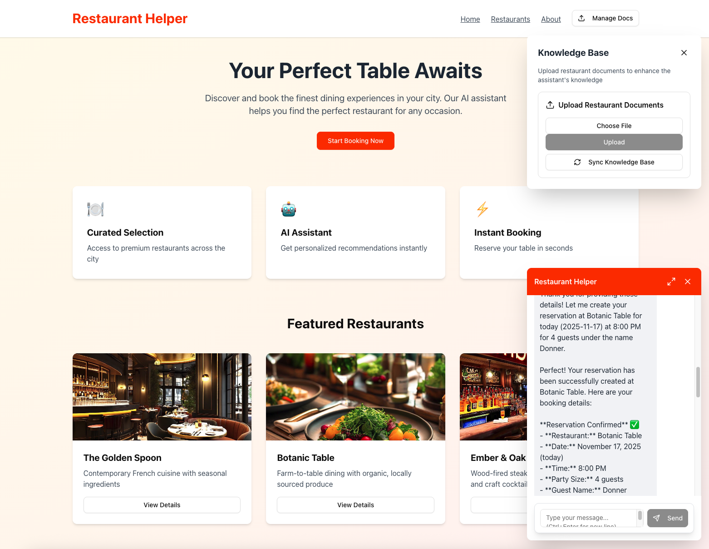

# Fullstack AgentCore Solution Template (FAST) - Sample Applications

This repository contains sample applications built using the [Fullstack AgentCore Solution Template (FAST)](https://github.com/awslabs/fullstack-solution-template-for-agentcore) as a starting point. Each sample demonstrates how to customize FAST for different use cases while leveraging AWS AgentCore.

> **⚠️ Important:** These samples are **not production-ready**. They pass automated security scanning at the time of contribution but are not guaranteed to receive ongoing security patches or dependency updates. You must thoroughly review any sample code before deploying to production. See [SECURITY.md](SECURITY.md) for details.

## Purpose

While [FAST](https://github.com/awslabs/fullstack-solution-template-for-agentcore) provides a fully functional out-of-the-box chat application, it's designed to be customized for any use case that leverages AgentCore. These samples serve as:

- **Reference implementations** for common patterns and use cases
- **Starting points** for similar projects
- **Best practice examples** of how to extend FAST
- **Learning resources** for engineers

## Available Samples

| Sample | Description |
|--------|-------------|
| [Restaurant Assistant](#restaurant-assistant) | Knowledge base integration, reservation management, and customer-facing chat widget |

<!-- Add new samples to the table above as they are added -->

### Restaurant Assistant
**Description**: A restaurant assistant application with knowledge base integration, reservation management, and a professional customer-facing interface.

**Built on FAST**: v0.4.1

**Key Differences from FAST**: Adds an s3-vector backed knowledge base, DynamoDB reservations table, custom reservation tools, restaurant-themed landing page with chat widget, and file upload capabilities

**Use Case**: Building customer service assistants for hospitality businesses or any domain requiring knowledge base integration with transactional capabilities



<!-- Template for new samples:
### [Sample Name](samples/sample-directory-name/)
**Description**: Brief description of what this sample demonstrates
**Built on FAST**: version
**Key Differences from FAST**: What makes this sample unique
**Use Case**: When you might want to use this pattern
-->

## Repository Structure

```
├── README.md              # This file
├── CONTRIBUTING.md        # Contribution guidelines
└── samples/               # Sample applications
```

## Contributing

Have you built something with FAST? We'd love to see it! Please see [CONTRIBUTING.md](CONTRIBUTING.md) for guidelines on how to contribute your sample application.

## Support

For questions about:
- **FAST itself**: See the main [FAST repository](https://github.com/awslabs/fullstack-solution-template-for-agentcore)
- **Specific samples**: Open an issue in this repository
- **Contributing samples**: See [CONTRIBUTING.md](CONTRIBUTING.md)

## License

This project is licensed under the Apache-2.0 License.

