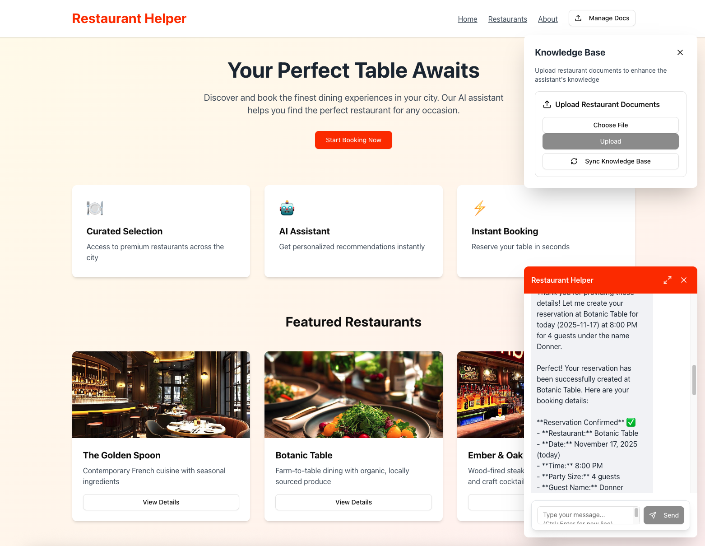
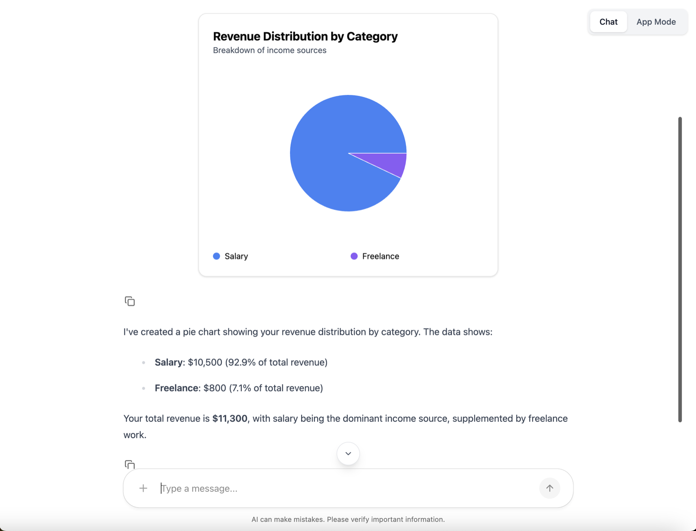
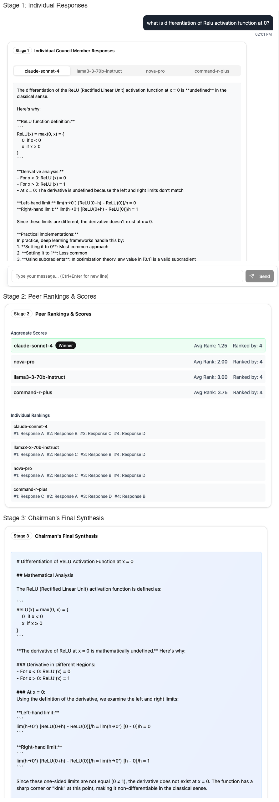
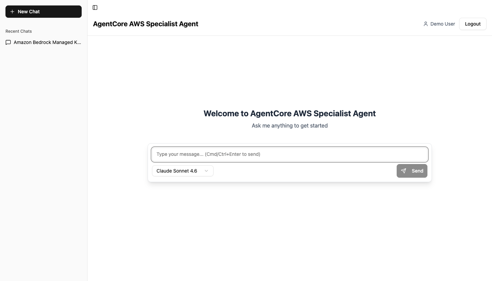
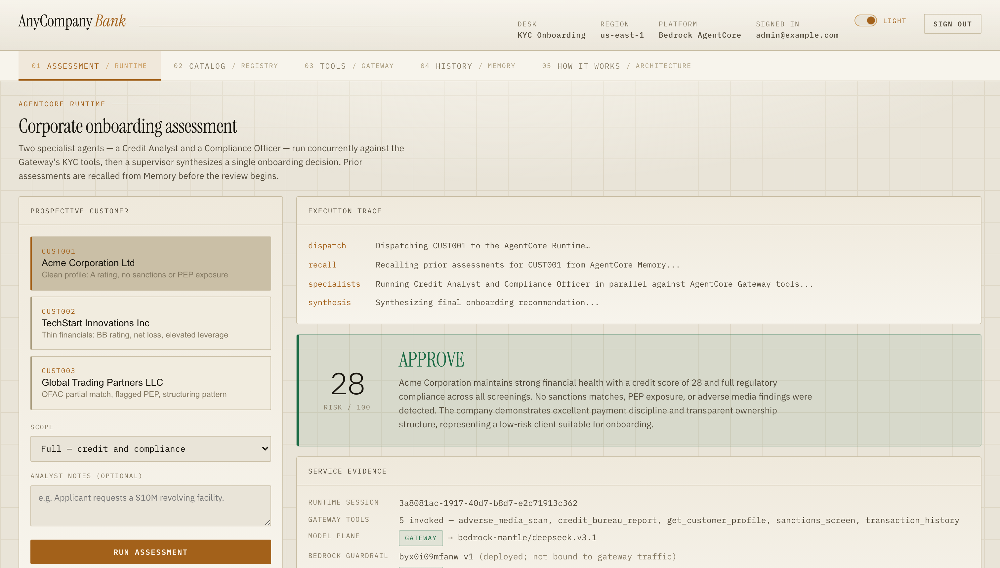
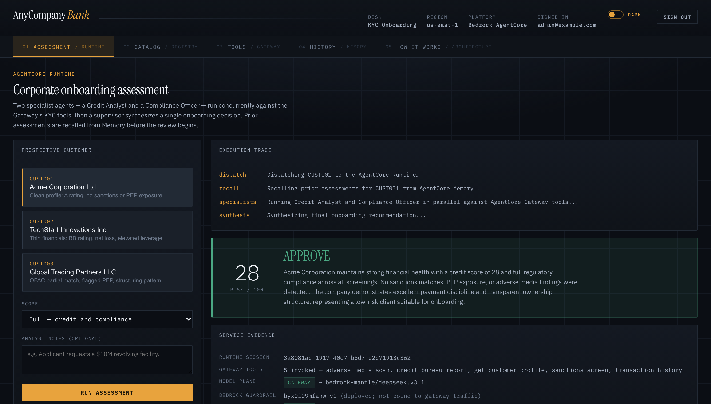
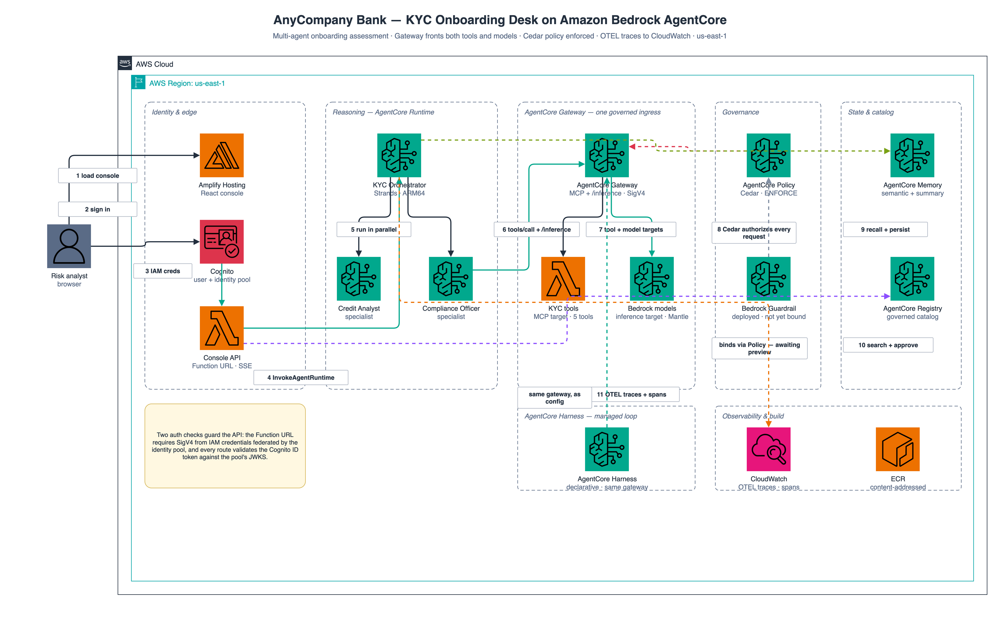

# Fullstack AgentCore Solution Template (FAST) - Sample Applications

This repository contains sample applications built using the [Fullstack AgentCore Solution Template (FAST)](https://github.com/awslabs/fullstack-solution-template-for-agentcore) as a starting point. Each sample demonstrates how to customize FAST for different use cases while leveraging AWS AgentCore.

> **⚠️ Important:** These samples are **not production-ready**. They pass automated security scanning at the time of contribution but are not guaranteed to receive ongoing security patches or dependency updates. You must thoroughly review any sample code before deploying to production. See [SECURITY.md](SECURITY.md) for details.

## Purpose

While [FAST](https://github.com/awslabs/fullstack-solution-template-for-agentcore) provides a fully functional out-of-the-box chat application, it's designed to be customized for any use case that leverages AgentCore. These samples serve as:

- **Starting points** for similar projects
- **A diverse set of examples** of how others have extended FAST for a variety of use cases
- **Learning resources** for engineers

## Available Samples

| Sample | Description |
|--------|-------------|
| [Restaurant Assistant](#restaurant-assistant) | Knowledge base integration, reservation management, and customer-facing chat widget |
| [CopilotKit Generative UI](#copilotkit-generative-ui) | Generative UI, shared state, and human-in-the-loop interactions via CopilotKit |
| [LLM Council](#llm-council) | An implementation of "Council of LLMs" pattern on AWS. Builds consensus among multiple diverse LLMs.|
| [Dual Monitoring System](#dual-monitoring-system) | Dual-layer monitoring for agentic solutions using AgentCore Evaluations and AWS DevOps Agent |
| [AgentCore AWS Specialist Agent](#agentcore-aws-specialist-agent) | AWS specialist chat agent with Gateway MCP tools, long-term memory, web search, Skills on Runtime, and a NAT-free VPC |
| [AnyCompany Bank](#anycompany-bank) | Governed multi-agent Know-Your-Customer onboarding — one Gateway fronts both tools (MCP) and models (inference), enforced by Cedar Policy, with a managed Harness, Guardrails, and OpenTelemetry observability |

<!-- Add new samples to the table above as they are added -->

### [Restaurant Assistant](samples/restaurant-assistant)
**Description**: A restaurant assistant application with knowledge base integration, reservation management, and a professional customer-facing interface.

**Built on FAST**: v0.4.1

**Key Differences from FAST**: Adds an s3-vector backed knowledge base, DynamoDB reservations table, custom reservation tools, restaurant-themed landing page with chat widget, and file upload capabilities

**Use Case**: Building customer service assistants for hospitality businesses or any domain requiring knowledge base integration with transactional capabilities

### [CopilotKit Generative UI](samples/copilotkit-generative-ui)
**Description**: Adds CopilotKit as the frontend framework on top of FAST, enabling generative UI (inline charts and components rendered from tool calls), bidirectional shared state between the agent and UI, and human-in-the-loop interactions.

**Built on FAST**: v0.4.1

**Key Differences from FAST**: Replaces the baseline frontend with CopilotKit, adds a CopilotKit Runtime Lambda as a server-side bridge to AgentCore, and includes both LangGraph and Strands agent patterns with CopilotKit middleware.

**Use Case**: Building agent-native applications where the AI drives the UI — not just chat — including dashboards, collaborative canvases, and interactive workflows.

### [LLM Council](samples/llm-council/)

**Description**: An implementation of "Council of LLMs" pattern on AWS. Multiple diverse LLMs collaborate through a 3-stage deliberation process -- independent responses, anonymized peer ranking, and chairman synthesis -- to produce higher-quality answers than any single model alone.

**Key Differences from FAST**: Replaces single-agent pattern with multi-model council orchestration, parallel Bedrock Converse API invocations across 4 providers (Anthropic, Meta, Amazon, Cohere), anonymized peer ranking with aggregate scoring, chairman synthesis stage, custom streaming event format with stage-by-stage SSE updates, council-specific React UI with tabbed model responses and ranking matrix

**Use Case**: Building applications where response quality matters more than latency, reducing single-model bias, combining strengths of diverse model providers, or any use case benefiting from collaborative AI deliberation

### [Dual Monitoring System](samples/dual-monitoring-system/)

**Description**: A dual-layer monitoring architecture for agentic solutions in dev/prod env. Layer 1 uses AgentCore Evaluations to continuously score live agent interactions with LLM-as-a-Judge methodology, surfacing quality degradation that infrastructure metrics miss. Layer 2 uses AWS DevOps Agent to autonomously investigate infrastructure incidents — pulling CloudWatch logs, building resource topology graphs, and tracing complete failure paths with remediation steps.

**Built on FAST**: v0.4.1

**Key Differences from FAST**: Adds an evaluation dashboard (session explorer, on-demand evaluation, AI pattern analysis, prompt improvement, online evaluation config), a DevOps Agent incident submission interface with SigV4-signed webhook proxy, a four-agent Strands swarm as the demo workload (supervisor, flight, user, and reservation agents), and additional CDK stacks for evaluation and DevOps Agent infrastructure.

**Use Case**: Monitoring multi-agent systems in production where traditional infrastructure metrics are insufficient — particularly swarm-based architectures with dynamic handoffs where quality degradation and failure propagation are hard to detect.

### [AgentCore AWS Specialist Agent](samples/aws-specialist-agent/)
**Description**: An AWS specialist chat agent showcased at the AgentCore booth at AWS Summit Japan 2026. The agent reasons about AWS, calls AWS APIs and managed tools through AgentCore Gateway, searches the web, executes code, and remembers facts across sessions.

**Built on FAST**: v0.4.1

**Key Differences from FAST**: Adds selectable models (Claude and OpenAI GPT on Bedrock via a CDK model registry), AgentCore Memory long-term memory with an LTM-listing MCP server, the Amazon-managed Web Search connector, a chat-history sidebar (API Gateway + Lambda + DynamoDB), a fully closed NAT-free VPC using only VPC endpoints, AWS Skills mounted from S3 Files at `/mnt/skills`, speculative pre-warming to cut cold-start latency, and multi-MCP-server management gated per user department by Cedar ABAC.

**Use Case**: Building production-oriented specialist agents that need fine-grained per-user tool authorization, private networking, long-term memory, and multiple MCP tool sources on AgentCore.

### [AnyCompany Bank](samples/anycompany-bank/)
**Description**: A governed multi-agent KYC onboarding desk on Amazon Bedrock AgentCore. A Credit Analyst and a Compliance Officer run concurrently against the Gateway's KYC tools, then a supervisor synthesizes one auditable APPROVE / REJECT / ESCALATE decision. The emphasis is platform governance — proving an agent was only ever allowed to call the tools it was scoped to.

**Built on FAST**: v0.4.2

**Key Differences from FAST**: Uses six AgentCore services together — Runtime (a Strands multi-agent workflow: two specialists in parallel, then synthesis), Gateway as a single governed ingress fronting both the five KYC tools (MCP target) and Bedrock models (inference target — the "LLM-gateway" pattern), Policy (Cedar authorization enforced server-side on every request in ENFORCE mode), Memory (per-customer assessment history), Agent Registry (governed catalog with a DRAFT → APPROVED workflow), and a managed Harness (the same assistant expressed as configuration). Also adds Bedrock Guardrails and ADOT/OpenTelemetry observability (traces and spans in CloudWatch Transaction Search).

**Use Case**: Governed, auditable multi-agent workflows in regulated domains (financial services, KYC/AML) that must prove per-request tool authorization and route both tool and model traffic through a single control point.

<!-- Template for new samples:
### [Sample Name](samples/sample-directory-name/)
**Description**: Brief description of what this sample demonstrates
**Built on FAST**: version
**Key Differences from FAST**: What makes this sample unique
**Use Case**: When you might want to use this pattern
-->

## Contributing

Have you built something with FAST? We'd love to see it! Please see [CONTRIBUTING.md](CONTRIBUTING.md) for guidelines on how to contribute your sample application.

## Support

For questions about:
- **FAST itself**: See the main [FAST repository](https://github.com/awslabs/fullstack-solution-template-for-agentcore)
- **Specific samples**: Open an issue in this repository
- **Contributing samples**: See [CONTRIBUTING.md](CONTRIBUTING.md)

## License

This project is licensed under the Apache-2.0 License.

