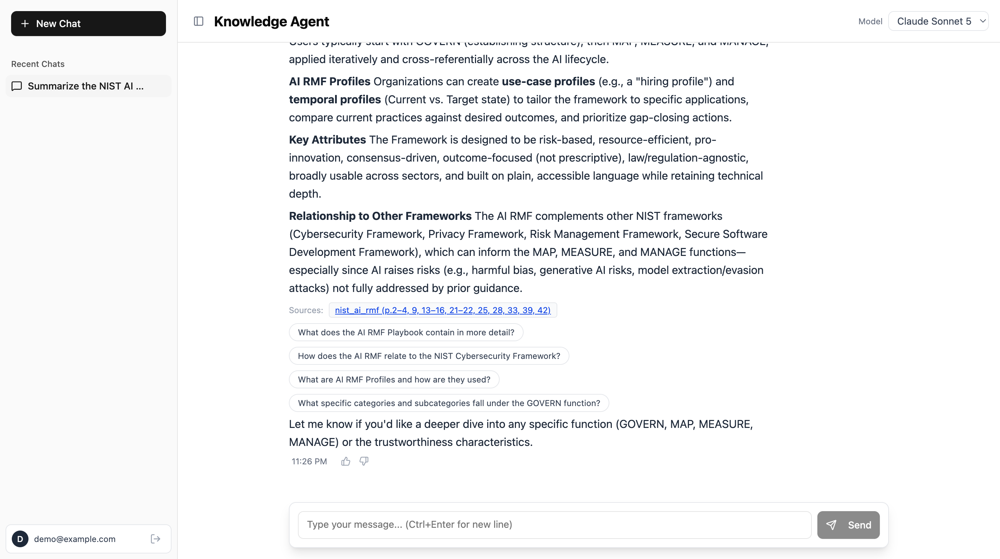
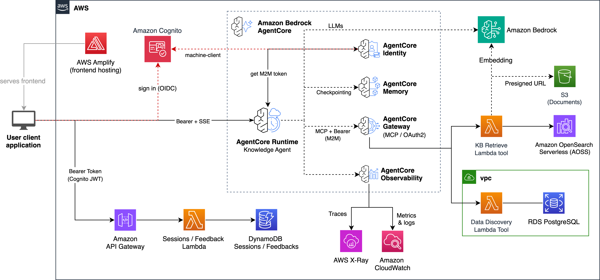

# Agentic Knowledge Discovery

A full-stack sample that answers questions over a mix of **unstructured documents** and
**structured metadata**, using an agent running on Amazon Bedrock AgentCore. The agent
plans its retrieval: it queries a metadata database to find the relevant documents, then
runs a filtered semantic search over their content, and cites the exact source pages.

It ships two interchangeable agent implementations — one built with
[Strands Agents](https://strandsagents.com/) and one with
[LangGraph](https://langchain-ai.github.io/langgraph/) — behind the same
[AG-UI](https://github.com/ag-ui-protocol/ag-ui) streaming protocol and the same React
frontend, so you can compare frameworks without changing anything else.



## What it demonstrates

- **Multi-source retrieval** — the agent combines a Bedrock Knowledge Base (unstructured
  document content) with an Aurora PostgreSQL table (structured document metadata).
- **Metadata filtering** — the same attributes (`domain`, `doc_type`, `num_pages`, …) exist
  in both stores, keyed by a shared `doc_id`, so the agent can discover documents with SQL
  and then scope a Knowledge Base search to just those documents with a metadata filter.
- **Citations with page links** — answers link back to the source PDF at the first cited page.
- **Two agent frameworks** — Strands and LangGraph, selectable via config.
- **Model selection** — Claude and GPT (through the Bedrock Mantle endpoint), chosen in the UI.
- **AgentCore building blocks** — Runtime, Gateway (tools over MCP), Memory (per-user
  conversation history), and Identity (user identity propagated from the browser JWT into
  the machine-to-machine gateway token).

## Key differences from FAST

Built on FAST, with these changes:

- Adds a Bedrock Knowledge Base (OpenSearch Serverless, Amazon Nova multimodal embeddings, hierarchical chunking, Bedrock Data Automation parsing) for unstructured document search.
- Adds an Aurora Serverless v2 PostgreSQL metadata store, seeded at deploy, for structured search.
- Replaces the single sample Gateway tool with two retrieval tools — `doc_search` (Knowledge Base) and `structured_search` (read-only SQL over Aurora) — that share a `doc_id` and metadata keys so the agent can combine structured and unstructured retrieval.
- Adds in-runtime `cite_sources` (presigned source links opening at the first cited page) and `suggest_questions` (follow-up chips), plus a frontend that groups internal tool calls into a collapsible "Analysis" block.
- Ships both Strands and LangGraph agent patterns behind the AG-UI protocol, with in-UI model selection (Claude, and GPT via the Bedrock Mantle endpoint on the Strands pattern).
- Adds a data-plane VPC for Aurora and the in-VPC Lambdas.
- Removes the base template's code interpreter, Cedar policy layer, and Terraform option to keep the sample focused on retrieval.

## Architecture



Authentication flows across the stack:

1. **User → frontend** (Cognito Authorization Code): the user signs in to the React app hosted on AWS Amplify and receives a JWT.
2. **Frontend → AgentCore Runtime** (JWT validation): the frontend sends the user's JWT; the Runtime validates it against the Cognito user pool.
3. **Runtime → AgentCore Gateway** (OAuth2 client credentials / M2M): the agent fetches a machine token, propagating the user's identity via the Cognito V3 pre-token Lambda so per-user claims ride along. The Gateway enforces inbound JWT authentication.
4. **Frontend → API Gateway** (JWT validation): the feedback and session-history APIs use the same Cognito authorizer.

> The gateway token carries user claims (`department`, `role`) as an extension point, but this sample does not enforce an authorization policy — it is authentication-only. Add a Gateway interceptor or per-tool checks to enforce access control.

## What gets deployed

- **Frontend**: React (TypeScript, Vite, Tailwind, shadcn/ui) on AWS Amplify Hosting.
- **Auth**: Amazon Cognito user pool (user login) + a confidential machine client (M2M).
- **Agent runtime**: Amazon Bedrock AgentCore Runtime (container image built from a pattern under `patterns/`).
- **Tools**: Amazon Bedrock AgentCore Gateway exposing Lambda tools over MCP — `doc_search` (Knowledge Base retrieval) and `structured_search` (read-only SQL over Aurora).
- **Memory**: AgentCore Memory for short-term conversation history (optional long-term semantic memory).
- **Knowledge Base**: Amazon Bedrock Knowledge Base over OpenSearch Serverless, using Amazon Nova multimodal embeddings, hierarchical chunking, and Bedrock Data Automation parsing.
- **Metadata store**: Amazon Aurora PostgreSQL (Serverless v2) with a `documents` table.
- **APIs**: feedback and session-history REST APIs (Amazon API Gateway + Lambda + DynamoDB).
- **Networking**: a VPC for the data plane (Aurora and the in-VPC Lambdas); the runtime is public and reaches data services over the managed Bedrock APIs.

## Prerequisites

- An AWS account and credentials with permissions to deploy the above.
- Amazon Bedrock model access enabled in your region for: Amazon Nova multimodal embeddings, an Anthropic Claude model, and Amazon Bedrock Data Automation.
- Node.js 18+ and npm.
- Python 3.13 and [uv](https://docs.astral.sh/uv/).
- Docker or [finch](https://github.com/runfinch/finch) (the agent runtime and one tool are built as ARM64 container images). For finch, set `CDK_DOCKER=finch`.
- The AWS CDK CLI (`npm i -g aws-cdk`) or use the bundled `npx cdk`.

## Deploy

```bash
# 1. Fetch the sample documents (from the repo root) — required before the first deploy.
#    Downloads four public-domain U.S. government PDFs into data/documents/ and
#    generates their metadata sidecars (see "Sample data" below).
python3 scripts/generate_sample_data.py

# 2. Backend (from infra-cdk/)
cd infra-cdk
npm install
CDK_DOCKER=finch npx cdk deploy --all --require-approval never

# 3. Frontend (from the repo root)
cd ..
python3 scripts/deploy-frontend.py
```

The frontend URL is printed by the deploy script and is available as the `AmplifyUrl` stack output. Create a Cognito user (or set `admin_user_email` in `config.yaml` before deploying to have one created for you), sign in, and start asking questions.

## Configuration

Everything is configured in `infra-cdk/config.yaml`:

- `backend.pattern` — which agent implementation to deploy: `strands-agent` (default) or `langgraph-agent`. Both speak AG-UI.
- `backend.agent_name` — the runtime name.
- `backend.use_long_term_memory` — enable cross-session semantic memory (adds per-record cost).
- `admin_user_email` — optionally create an admin Cognito user and email credentials.

The model list offered in the UI is defined in `patterns/utils/models.py`. GPT models run through the Bedrock Mantle endpoint and are supported on the Strands pattern; the LangGraph pattern falls back to the default Bedrock model for GPT selections.

## Agent tools

- `structured_search` — runs read-only SQL against the Aurora `documents` table to discover documents and attribute values.
- `doc_search` — batched semantic + keyword search over the Knowledge Base, with optional metadata filters, de-duplicated across the batch.
- `cite_sources` — turns the documents the agent used into presigned links (opening at the first cited page).
- `suggest_questions` — proposes follow-up questions shown as clickable chips.

## Sample data

The PDFs are **not stored in this repository**. Running `python3 scripts/generate_sample_data.py`
(step 1 of Deploy) downloads them from their official .gov sources into `data/documents/` and
generates the metadata sidecars and the database seed file. The Knowledge Base ingests
`data/documents/` at deploy time, so run the script before the first `cdk deploy`.

The four documents are real **U.S. government publications in the public domain**
(17 U.S.C. §105 — free to use, modify, and redistribute, including commercially, with no
attribution requirement). They span four domains so metadata filtering is meaningful:

- `nist_ai_rmf` — AI Risk Management Framework, NIST AI 100-1 (domain `artificial_intelligence`).
- `nist_cybersecurity_framework` — Cybersecurity Framework 2.0, NIST CSWP 29 (domain `cybersecurity`).
- `eia_annual_energy_outlook_2023` — Annual Energy Outlook 2023, U.S. Energy Information Administration (domain `energy`).
- `nces_education_report_2023` — a National Center for Education Statistics report (domain `education`).

Each document has a small, generic metadata set kept in sync from a single source
(`scripts/generate_sample_data.py`):

- `doc_id` — the PDF filename stem; links the structured row to its Knowledge Base document.
- `domain` — subject domain.
- `doc_type` — coarse type label (`framework`, `report`).
- `num_pages` — page count (a numeric field, useful for range filters).

The metadata lives in two places: the Aurora `documents` table (queried by `structured_search`)
and a `<file>.pdf.metadata.json` sidecar next to each PDF (ingested by the Knowledge Base as
query-time metadata filters for `doc_search`). Because the keys match and `doc_id` is shared,
the agent can move between structured facts and document content — e.g. find documents where
`domain = 'energy'`, then search only those.

To use your own documents, drop PDFs into `data/documents/`, add entries for them to
`DOCUMENTS` in `scripts/generate_sample_data.py` (the download step skips files that
already exist locally, so the `source_url` is unused for your own files), run the
script, and redeploy.

## Cost

This sample provisions services that bill while running — most notably OpenSearch Serverless
(the Knowledge Base vector store has an ongoing minimum capacity cost) and Aurora Serverless v2.
You also pay per use for Bedrock embeddings, Data Automation parsing, and model inference.
Deploy in a non-production account and tear it down when you are done.

## Cleanup

```bash
cd infra-cdk
CDK_DOCKER=finch npx cdk destroy --all
```

Buckets and the vector store are configured to be removed with the stack.

## Security

This is a sample intended to demonstrate an architecture, not a production-ready system. You
are responsible for reviewing and hardening it for your use case — including authorization,
network posture, logging, and data handling — under the AWS Shared Responsibility Model. To
report a security issue, see the [AWS vulnerability reporting page](http://aws.amazon.com/security/vulnerability-reporting/).

## License

This project is licensed under the Apache-2.0 License. See [LICENSE](LICENSE). The bundled
sample documents are U.S. government works in the public domain (see **Sample data** above).
