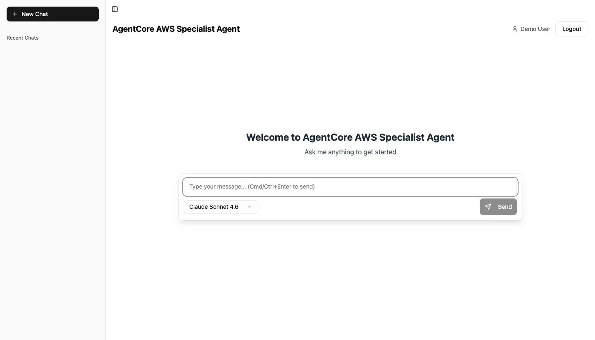
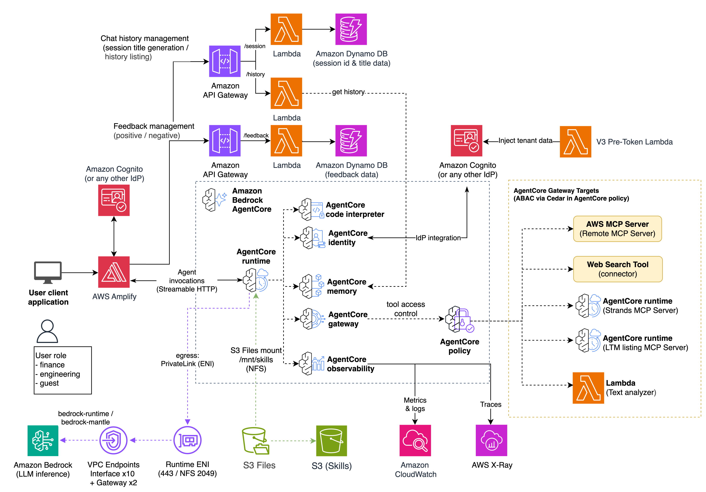

# AgentCore AWS Specialist Agent

> [!NOTE]
> A deep-dive article on the implementation techniques used in this project is available. Please check it out!
> https://zenn-dev.translate.goog/aws_japan/articles/006-aws-specialist-agent?_x_tr_sl=ja&_x_tr_tl=en&_x_tr_hl=ja&_x_tr_pto=wapp&_x_tr_hist=true

> 日本語版の README は [README-jp.md](README-jp.md) を参照してください。

An AWS specialist agent demo built on Amazon Bedrock AgentCore: a secured, web-accessible chat application whose agent can reason about AWS, call AWS APIs and managed tools, search the web, and remember facts across sessions. This sample was showcased at the AgentCore booth at AWS Summit Japan 2026.



## Overview

This sample customizes [FAST](https://github.com/awslabs/fullstack-solution-template-for-agentcore) (the Fullstack AgentCore Solution Template) into a production-grade AWS specialist agent. On top of the FAST baseline it adds AWS specialist capabilities — tools, long-term memory, and model selection — to a multi-turn chat agent. The implementation addresses common challenges in running agents in production, such as latency reduction through speculative pre-warming, fully private egress connectivity, per-user tool authorization, management of multiple MCP servers, and the use of Skills on AgentCore Runtime. This is a starting point; customize it freely for your own use case.

**Built on FAST**: v0.4.1

The capabilities shipped out of the box include:

1. **MCP tools via AgentCore Gateway** (authorized per department by Cedar ABAC):
   - **aws-mcp** — general AWS operations: run AWS CLI commands (`call_aws`), execute boto3 scripts (`run_script`), search and read AWS documentation (`search_documentation` / `read_documentation`), look up region info (`get_regional_availability` / `list_regions`), and retrieve skills (`retrieve_skill`)
   - **web-search-tool** — Amazon-managed real-time web search (`WebSearch`) that grounds answers in information newer than the model's training cutoff, with sources cited
   - **strands-mcp** — search and fetch Strands Agents SDK documentation (`search_docs` / `fetch_doc`)
   - **ltm-mcp** — list the user's long-term memories from past sessions (`list_long_term_memories`)
   - **sample-tool-target** — a sample text-analysis tool (`text_analysis_tool`, counts words and letter frequency)
2. **Local tools** (built into the Runtime, available to all users):
   - **Code Interpreter** — direct integration with Amazon Bedrock AgentCore Code Interpreter: secure code execution (Python / JS / TS) in an isolated sandbox with state-persistent sessions
   - **skills** / **file_read** — load and activate AWS skills (aws-cdk, aws-iam, amazon-bedrock, etc.) mounted from S3 Files at `/mnt/skills`
3. **Long-term memory (AgentCore Memory)** — a SemanticMemoryStrategy extracts facts from conversations and auto-injects relevant facts in later sessions (per Cognito user)
4. **Model selection** — switch models per chat from the UI selector: Claude (Fable 5 / Opus / Sonnet / Haiku) on Bedrock and OpenAI GPT served through Bedrock

Try asking the agent things like "Is Lambda available in us-east-2?", "Show me how to create a VPC with CDK following the skill", or "What are the latest Bedrock AgentCore features — search the web and cite your sources" to see these tools in action.

## Key Differences from FAST

- **Selectable models** — a single model registry (`infra-cdk/lib/utils/model-registry.ts`) drives a per-chat UI selector covering Claude (Fable 5 / Opus / Sonnet / Haiku) on Bedrock and OpenAI GPT served through Bedrock
- **Long-term memory** — AgentCore Memory with a SemanticMemoryStrategy, plus an MCP tool that lists stored memories for meta-recall questions
- **Web search** — the Amazon-managed Web Search connector target on the AgentCore Gateway
- **Chat-history sidebar** — session titles and history restored across logins (API Gateway + Lambda + DynamoDB)
- **Fully closed (NAT-free) VPC** — the Runtime and auxiliary Lambdas reach every AWS service through interface / gateway VPC endpoints only
- **Skills on Runtime** — AWS skills mounted from S3 Files at `/mnt/skills`, including a self-describing project-guide skill
- **Speculative pre-warming** — frontend pre-warm calls plus a Runtime lifecycle configuration cut cold-start TTFB
- **Multiple MCP server management** — Gateway targets for remote MCP servers, Runtime-hosted MCP servers, a connector target, and a Lambda target, all gated per user department by Cedar ABAC

See the "Design notes" sections in `docs/*.md` for the rationale behind the major derivative-specific decisions. Much of the documentation describes the underlying FAST baseline, which this project builds on; "FAST" therefore refers to that baseline throughout.

## Architecture



The diagram above shows this project's architecture. On top of the FAST baseline it adds selectable Bedrock and OpenAI models, long-term memory, web search, a chat-history sidebar, and a fully closed (NAT-free) VPC.

**Authentication flows:**

1. User login to the frontend (Cognito User Pool — Authorization Code grant): The user authenticates with Cognito via the web application hosted on AWS Amplify. Cognito issues a JWT access token for the session.
2. Frontend to AgentCore Runtime (Cognito User Pool JWT validation): The frontend passes the user's JWT in the Authorization header. The Runtime validates the token against the Cognito User Pool.
3. AgentCore Runtime to AgentCore Gateway (OAuth2 Client Credentials / M2M): The Runtime authenticates using the OAuth2 Client Credentials grant with user identity propagated into the M2M token via the Cognito V3 Pre-Token Lambda. The Gateway evaluates Cedar policies against the user's claims to enforce fine-grained access control (finance / engineering / guest roles).
4. Frontend to API Gateway (Cognito User Pool JWT validation): API requests (chat history, feedback) are authenticated using a Cognito User Pools Authorizer with the same user JWT from Flow 1.

**Tools and capabilities** (exposed through the AgentCore Gateway and the Runtime, gated by Cedar policies):

- **AWS MCP Server** (remote MCP target) for AWS API access, and a **text-analyzer Lambda** target
- **Web Search** (managed connector) and the **Strands docs** / **long-term-memory listing** MCP servers (each hosted on its own AgentCore Runtime)
- **Code Interpreter**, **AgentCore Memory** (long-term memory), and **skills** mounted from S3 Files at `/mnt/skills`

**Closed network**: the Runtime and the auxiliary Lambdas (chat history, feedback, pre-token) run inside an isolated VPC and reach every AWS service through interface / gateway VPC endpoints — there is no NAT gateway. See the "Design notes" sections in `docs/*.md` for the rationale.

### Tech Stack

- **Frontend**: React with TypeScript, Vite, Tailwind CSS, and shadcn components - infinitely flexible and ready for coding assistants
- **Models**: selectable per chat from a single registry — Claude (Fable 5 / Opus / Sonnet / Haiku) on Bedrock and OpenAI GPT served through Bedrock
- **Agent**: Strands agent running within AgentCore Runtime (VPC mode)
- **Authentication**: AWS Cognito User Pool with OAuth support for easy swapping out Cognito
- **Infrastructure**: CDK deployment (TypeScript) with Amplify Hosting for frontend and AgentCore backend

## Prerequisites

Beyond the core FAST requirements (an AWS account with CDK bootstrapped, Node.js 20+, Python 3.13+, and Docker):

- **Model access** in the deployment region for the models you enable in the registry (Claude on Bedrock; OpenAI GPT served through Bedrock if enabled)
- **Amazon Bedrock AgentCore** availability in the deployment region (Runtime, Gateway, Memory, Code Interpreter, Identity, Policy)

## Deployment

Deploying the full stack out-of-the-box application is only a few cdk commands:

```bash
cd infra-cdk
npm install
cdk bootstrap # Once ever
cdk deploy
cd ..
python scripts/deploy-frontend.py
```

See the [deployment guide](docs/DEPLOYMENT.md) for detailed instructions on how to deploy this application into an AWS account, including configuration options in `infra-cdk/config.yaml` (admin user email, demo users, model selection, VPC settings).

## Usage

Log in with the admin user created during deployment (or demo users created via `scripts/create-demo-users.py`). Pick a model from the selector, then try queries that exercise the specialist tools:

- "Is Lambda available in us-east-2?" (region availability lookup)
- "Show me how to create a VPC with CDK following the skill" (skills)
- "What are the latest Bedrock AgentCore features — search the web and cite your sources" (web search)
- "Run this Python snippet and show the output" (Code Interpreter)
- "What do you remember about me?" (long-term memory)

Tool availability differs per user department (finance / engineering / guest) — see [docs/CEDAR_POLICY_GUIDE.md](docs/CEDAR_POLICY_GUIDE.md).

What comes next? That's up to you, the developer. With your requirements in mind, open up your coding assistant, describe what you'd like to do, and begin. The steering docs in this repository help guide coding assistants with best practices, and encourage them to always refer to the documentation built-in to the repository to make sure you end up building something great.

## Project Structure

```
aws-specialist-agent/
├── docker/                 # Docker development environment
│   ├── docker-compose.yml  # Local development stack
│   └── Dockerfile.frontend.dev # Frontend development container
├── frontend/               # React frontend application
│   ├── src/
│   │   ├── components/     # React components (shadcn/ui), incl. chat UI
│   │   ├── hooks/          # Custom React hooks
│   │   ├── lib/            # Utility libraries
│   │   │   └── agentcore-client/ # AgentCore streaming client
│   │   ├── test/           # Frontend tests
│   │   └── types/          # TypeScript type definitions
│   ├── public/             # Static assets
│   ├── components.json     # shadcn/ui configuration
│   ├── vite.config.ts      # Vite configuration
│   └── package.json
├── infra-cdk/              # CDK infrastructure code
│   ├── lib/                # CDK stack definitions
│   │   ├── utils/          # Shared CDK utilities (incl. model registry)
│   │   ├── amplify-hosting-stack.ts
│   │   ├── backend-stack.ts
│   │   ├── cognito-stack.ts
│   │   ├── skills-storage-stack.ts # S3 Files skills bucket + mount
│   │   ├── vpc-stack.ts    # Closed VPC + interface/gateway endpoints
│   │   └── fast-main-stack.ts
│   ├── bin/                # CDK app entry point
│   ├── lambdas/            # Lambda function code
│   │   ├── cedar-policy/    # Cedar Policy Engine lifecycle
│   │   ├── oauth2-provider/ # OAuth2 Credential Provider lifecycle
│   │   ├── pretoken-v3/     # Cognito V3 Pre-Token Generation Lambda
│   │   ├── feedback/       # Feedback API handler
│   │   ├── history/        # Chat-history API handler
│   │   ├── sessions/       # Session title generation / listing
│   │   └── zip-packager/   # Runtime ZIP packager
│   └── config.yaml         # Deployment configuration
├── agent/                  # Agent pattern implementations
│   ├── strands-single-agent/ # Strands agent (the deployed pattern)
│   │   ├── basic_agent.py  # Agent entrypoint, tools, system prompt
│   │   ├── models.py       # Model factory (Bedrock + OpenAI on Bedrock)
│   │   ├── tools/          # Agent-side tool wiring (gateway client, etc.)
│   │   ├── requirements.txt # Agent dependencies
│   │   └── Dockerfile      # Container configuration
│   └── utils/              # Shared agent utilities (auth, ssm)
├── gateway/                # Gateway tools and Cedar policies
│   ├── policies/           # Cedar policy definitions (one statement per file)
│   │   ├── 01-sample-tool.cedar
│   │   ├── 02-aws-mcp-read.cedar
│   │   ├── 03-aws-mcp-destructive.cedar
│   │   ├── 04-ltm-mcp.cedar
│   │   ├── 05-strands-mcp.cedar
│   │   └── 06-web-search.cedar
│   └── tools/              # Gateway tool implementations
│       ├── sample_tool/    # Text-analyzer Lambda target
│       ├── ltm_mcp_server/ # Long-term-memory listing MCP server
│       └── strands_mcp_server/ # Strands docs MCP server
├── skills/                 # Skills mounted into the runtime via S3 Files
│   ├── agent-toolkit-for-aws/ # Vendored upstream AWS skills (pinned)
│   └── aws-specialist-agent/  # This project's own skills
│       └── fast-project-guide/ # Self-describing project guide skill
├── scripts/                # Deployment and utility scripts (see scripts/README.md)
│   ├── deploy-frontend.py  # Cross-platform frontend deployment
│   ├── deploy-with-codebuild.py # Cloud deployment via CodeBuild
│   ├── build-project-guide.py # Builds the fast-project-guide skill
│   ├── vendor-skills.py    # Re-vendors the upstream AWS skills
│   ├── create-demo-users.py # Demo Cognito user management
│   └── utils.py            # Shared script utilities
├── test-scripts/           # End-to-end verification scripts
├── tests/                  # Unit/integration test suite
│   ├── unit/
│   └── conftest.py         # Pytest configuration
├── docs/                   # Documentation (English; docs-jp/ holds JA copies)
│   ├── architecture-diagram/ # Architecture diagrams
│   ├── DEPLOYMENT.md       # Deployment guide
│   ├── AGENT_CONFIGURATION.md # Agent + model configuration
│   ├── MEMORY_INTEGRATION.md # Long-term memory guide
│   ├── GATEWAY.md          # Gateway + tool targets guide
│   ├── CEDAR_POLICY_GUIDE.md # Cedar policy / ABAC reference
│   ├── CONTEXT_MANAGEMENT.md # Context window + chat history guide
│   ├── SKILLS.md           # Skills mounting + design notes
│   └── ...                 # (and more)
├── docs-jp/                # Japanese translations of docs/
├── vibe-context/           # AI coding assistant context and rules
│   ├── AGENTS.md           # Rules for AI assistants
│   ├── coding-conventions.md # Code style guidelines
│   └── development-best-practices.md # Development guidelines
├── CHANGELOG.md            # Version history
├── Makefile                # Project-level build commands
└── README.md
```

## Security

Note: this asset represents a proof-of-value for the services included and is not intended as a production-ready solution. You must determine how the AWS Shared Responsibility applies to their specific use case and implement the needed controls to achieve their desired security outcomes. AWS offers a broad set of security tools and configurations to enable our customers.

Ultimately it is your responsibility as the developer of a full stack application to ensure all of its aspects are secure. We provide security best practices in repository documentation and provide a secure baseline but Amazon holds no responsibility for the security of applications built from this tool.

## License

This project is licensed under the Apache-2.0 License.
