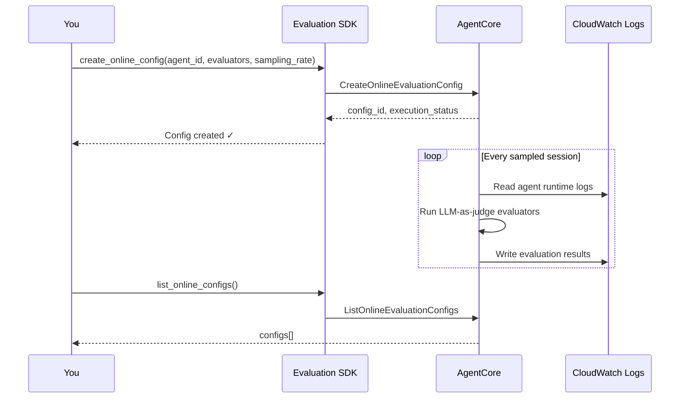
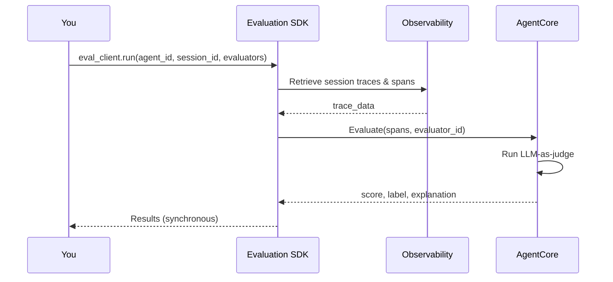
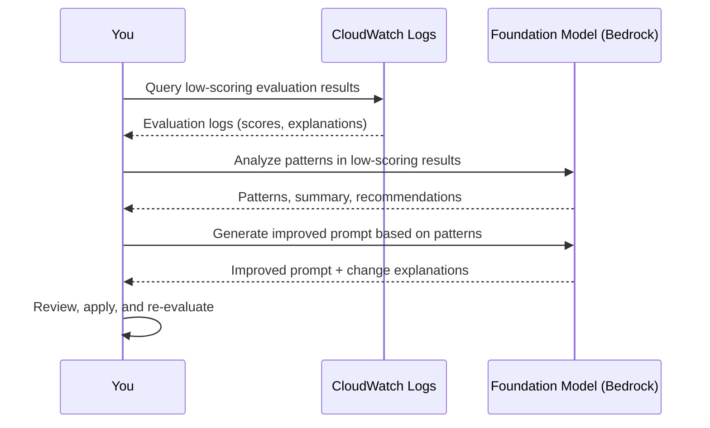
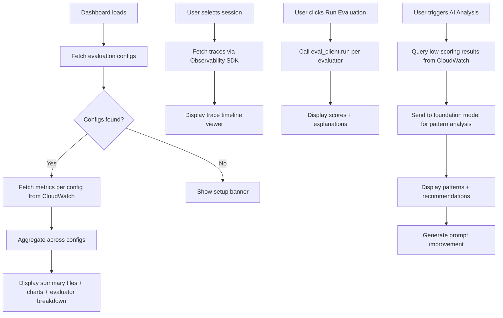

# Amazon Bedrock AgentCore Evaluations ガイド

このガイドでは、Amazon Bedrock AgentCore の評価機能を使って AI エージェントのパフォーマンスを評価・モニタリングする方法を解説します。オンデマンド評価の起動、オンライン (ライブ) 評価の設定、利用可能なメトリクスの理解、結果のダウンロード、AI を活用した分析によるエージェント改善、ダッシュボード構築の手順を含みます。

---

## 目次

1. [前提条件](#前提条件)
2. [SDK のインストール](#sdk-のインストール)
3. [オンライン (ライブ) 評価](#オンライン-ライブ-評価)
4. [オンデマンド評価](#オンデマンド評価)
5. [組み込み評価器リファレンス](#組み込み評価器リファレンス)
6. [カスタム評価器](#カスタム評価器)
7. [評価結果とフォーマット](#評価結果とフォーマット)
8. [結果のダウンロードとクエリ](#結果のダウンロードとクエリ)
9. [AI 駆動の分析](#ai-駆動の分析)
10. [セッション、トレース、スパンの取得 (Observability)](#セッショントレーススパンの取得-observability)
11. [ダッシュボードの構築](#ダッシュボードの構築)
12. [ベストプラクティス](#ベストプラクティス)
13. [参考資料](#参考資料)

---

## 前提条件

- デプロイ済みのエージェントを持つ Amazon Bedrock AgentCore ランタイム
- 以下の権限を持つ AWS 認証情報:
  - `bedrock-agentcore:*` (コントロールプレーンおよびデータプレーン)
  - `iam:CreateRole`、`iam:AttachRolePolicy`、`iam:PutRolePolicy`、`iam:GetRole`、`iam:PassRole` (`AgentCoreEvalsSDK-*` ロールに限定)
  - `logs:DescribeLogGroups`、`logs:FilterLogEvents`、`logs:GetLogEvents` (評価結果のロググループ用)
  - `bedrock:InvokeModel` (LLM-as-judge 評価用)
- boto3 が利用可能な Python 3.10 以上

> **リージョンの可用性:** クロスリージョン推論プロファイル (例: `us.anthropic.claude-sonnet-4-5-20250929-v1:0`) はシステム定義であり、ARN 内のアカウント ID は空になります。IAM ポリシーには、アカウントレベルおよびシステムレベルのプロファイルの両方をカバーするため、`arn:aws:bedrock:*:*:inference-profile/*` と `arn:aws:bedrock:*::inference-profile/*` の両方を含める必要があります。モデルの利用可否については [Bedrock サポート対象リージョン](https://docs.aws.amazon.com/bedrock/latest/userguide/bedrock-regions.html) を確認してください。

### IAM ポリシーの例

```json
{
  "Version": "2012-10-17",
  "Statement": [
    {
      "Effect": "Allow",
      "Action": [
        "bedrock-agentcore:CreateEvaluator",
        "bedrock-agentcore:ListEvaluators",
        "bedrock-agentcore:GetEvaluator",
        "bedrock-agentcore:UpdateEvaluator",
        "bedrock-agentcore:DeleteEvaluator",
        "bedrock-agentcore:CreateOnlineEvaluation",
        "bedrock-agentcore:ListOnlineEvaluations",
        "bedrock-agentcore:GetOnlineEvaluation",
        "bedrock-agentcore:UpdateOnlineEvaluation",
        "bedrock-agentcore:DeleteOnlineEvaluation",
        "bedrock-agentcore:Evaluate",
        "bedrock-agentcore:ListEvaluationResults"
      ],
      "Resource": "*"
    },
    {
      "Effect": "Allow",
      "Action": [
        "iam:CreateRole",
        "iam:AttachRolePolicy",
        "iam:PutRolePolicy",
        "iam:GetRole",
        "iam:PassRole"
      ],
      "Resource": "arn:aws:iam::*:role/AgentCoreEvalsSDK-*"
    },
    {
      "Effect": "Allow",
      "Action": ["logs:DescribeLogGroups", "logs:FilterLogEvents", "logs:GetLogEvents"],
      "Resource": "arn:aws:logs:*:*:log-group:/aws/bedrock-agentcore/evaluations/*"
    },
    {
      "Effect": "Allow",
      "Action": ["bedrock:InvokeModel"],
      "Resource": [
        "arn:aws:bedrock:*:*:inference-profile/*",
        "arn:aws:bedrock:*::inference-profile/*"
      ]
    }
  ]
}
```

---

## SDK のインストール

AgentCore starter toolkit をインストールします。

```bash
pip install bedrock-agentcore-starter-toolkit
```

評価クライアントを初期化します。

```python
from bedrock_agentcore_starter_toolkit import Evaluation

eval_client = Evaluation(region="us-east-1")
```

---

## オンライン (ライブ) 評価

オンライン評価では、ライブセッションの一定割合をサンプリングして評価器を自動実行することで、エージェントを継続的にモニタリングします。結果は CloudWatch Logs に書き込まれます。



### オンライン評価設定の作成

特定の環境でエージェントの品質を継続的にモニタリングしたい場合に使用します。

> **補足:** `auto_create_execution_role=True` が IAM ロールの自動作成を発動させます。SDK は `AgentCoreEvalsSDK-{region}-{hash}` という名前のロールを作成し、エージェントの CloudWatch ログを読み取り、LLM-as-judge スコアリングのために Bedrock モデルを呼び出す権限を付与します。

```python
from bedrock_agentcore_starter_toolkit import Evaluation

eval_client = Evaluation(region="us-east-1")

# agent_id はランタイム ARN の最後のセグメント
# 例: "arn:aws:bedrock-agentcore:us-east-1:123456789:runtime/my-agent-abc123" の "my-agent-abc123"
agent_id = "my-agent-abc123"  # 実際のエージェント ID に置き換えてください

response = eval_client.create_online_config(
    agent_id=agent_id,
    config_name="production_eval",
    sampling_rate=10.0,                    # セッションの 10% を評価
    evaluator_list=[
        "Builtin.Helpfulness",
        "Builtin.Correctness",
        "Builtin.GoalSuccessRate",
    ],
    config_description="Production evaluation with core metrics",
    auto_create_execution_role=True,       # IAM ロールを自動作成
    enable_on_create=True,                 # 即座に評価を開始
)

config_id = response["onlineEvaluationConfigId"]  # メトリクスを照会する際に必要なので保存しておく
print(f"Created config: {config_id}")
print(f"Status: {response['executionStatus']}")
```

> **タイミング:** 設定の作成は通常 10〜30 秒で完了します。エージェントが次のセッションを処理した 2〜5 分後から、評価結果が CloudWatch に表示され始めます。

### オンライン評価の有効化 / 無効化

設定を失わずに評価を一時的に停止したい場合 (例: メンテナンスウィンドウやコスト管理時) に使用します。

```python
# 評価を無効化 (削除せずに一時停止)
eval_client.update_online_config(
    config_id="your-config-id",  # 実際の config ID に置き換えてください
    execution_status="DISABLED"
)

# 評価を再度有効化
eval_client.update_online_config(
    config_id="your-config-id",
    execution_status="ENABLED"
)
```

### サンプリングレートの更新

設定を再作成せずにコストとカバレッジのトレードオフを調整したい場合に使用します。

```python
eval_client.update_online_config(
    config_id="your-config-id",
    sampling_rate=5.0  # コスト削減のために 5% に減らす
)
```

### すべての設定の一覧表示

```python
configs = eval_client.list_online_configs()
for config in configs.get("onlineEvaluationConfigs", []):
    print(f"{config['onlineEvaluationConfigName']}: {config['executionStatus']} "
          f"(sampling: {config.get('samplingRate', 'N/A')}%)")
```

### 設定の削除

```python
eval_client.delete_online_config(config_id="your-config-id")
```

---

## オンデマンド評価

オンデマンド評価では、特定のセッションを即座に評価し、結果を同期的に取得できます。SDK は AgentCore Observability からセッションのトレースを自動的に取得します。



### 単一セッションの評価

特定の会話をスポットチェックしたり、ユーザーから報告された問題をデバッグしたり、プロンプト変更後のエージェントの動作を検証したりする際に使用します。

> **タイミング:** 各評価器はセッションあたり 5〜15 秒かかります。1 つのセッションに対して 3 つの評価器を実行する場合、通常 15〜45 秒で完了します。

```python
from bedrock_agentcore_starter_toolkit import Evaluation

eval_client = Evaluation(region="us-east-1")

agent_id = "my-agent-abc123"      # 実際のエージェント ID に置き換えてください
session_id = "session-456"         # 実際のセッション ID に置き換えてください

# 1 つ以上の評価器をセッションに対して実行
results = eval_client.run(
    agent_id=agent_id,
    session_id=session_id,
    evaluators=["Builtin.Helpfulness", "Builtin.Correctness"]
)

for result in results.results:
    print(f"Evaluator: {result.evaluator_name}")
    print(f"  Score:       {result.value:.2f}")
    print(f"  Label:       {result.label}")
    print(f"  Explanation: {result.explanation}")
    if hasattr(result, 'token_usage') and result.token_usage:
        print(f"  Tokens:      {result.token_usage}")
    print()
```

### 低レベル boto3 API による評価

きめ細かい制御が必要な場合 (たとえば、セッション全体ではなく特定のスパンを評価する場合や、すでにスパンを自分で取得している場合) に使用します。

```python
import boto3

bedrock_agentcore = boto3.client("bedrock-agentcore")

response = bedrock_agentcore.evaluate(
    evaluatorId="Builtin.Helpfulness",
    evaluationInput={
        "sessionSpans": [
            {
                "traceId": "abc123",
                "spanId": "def456",
                "name": "agent_response",
                "startTimeUnixNano": 1708128000000000000,
                "endTimeUnixNano": 1708128001000000000,
                "attributes": {
                    "session.id": "session-456"
                },
                "status": {"code": "OK"},
                "scope": {"name": "bedrock-agentcore"}
            }
        ]
    },
    evaluationTarget={
        "traceIds": ["abc123"],    # オプション: 特定のトレースに範囲を限定
        "spanIds": ["def456"]      # オプション: 特定のスパンに範囲を限定
    }
)

for result in response.get("evaluationResults", []):
    print(f"Score: {result['value']}, Label: {result['label']}")
    print(f"Explanation: {result['explanation']}")
```

### バッチ評価 (複数セッション)

プロンプト変更やデプロイ後に一連のセッションを評価し、品質の前後比較を行う場合に使用します。

> **タイミング:** バッチ評価は逐次実行されます。評価器ごと、セッションごとに約 10 秒かかります。10 セッションを 2 つの評価器で評価する場合、おおよそ 3〜4 分かかります。

```python
agent_id = "my-agent-abc123"
session_ids = ["session-001", "session-002", "session-003"]  # 実際の ID に置き換えてください
evaluators = ["Builtin.Helpfulness", "Builtin.Correctness"]

all_results = []
for session_id in session_ids:
    try:
        results = eval_client.run(
            agent_id=agent_id,
            session_id=session_id,
            evaluators=evaluators
        )
        all_results.append({
            "session_id": session_id,
            "results": [
                {
                    "evaluator": r.evaluator_name,
                    "score": r.value,
                    "label": r.label,
                    "explanation": r.explanation
                }
                for r in results.results
            ]
        })
    except Exception as e:
        print(f"Failed to evaluate {session_id}: {e}")

print(f"Evaluated {len(all_results)} sessions successfully")
```

---

## 組み込み評価器リファレンス

AgentCore は 3 つの評価レベルにまたがる 15 の組み込み評価器を提供します。

### 評価レベルの判断ツリー

| 目的                       | 使用するレベル | 理由                                 |
| -------------------------- | -------------- | ------------------------------------ |
| 全体的なタスク完了度を測定 | SESSION        | 会話全体をエンドツーエンドで評価     |
| 個々の応答品質を評価       | TRACE          | エージェントの各ターンを独立して評価 |
| ツール使用の正しさを検証   | TOOL_CALL      | 特定のツール呼び出しを評価           |

### 品質と関連性 (TRACE レベル)

| 評価器 ID                      | 測定内容                                                         |
| ------------------------------ | ---------------------------------------------------------------- |
| `Builtin.Helpfulness`          | ユーザーの観点から見た応答の有用性と価値                         |
| `Builtin.Correctness`          | 応答に含まれる情報が事実として正確かどうか                       |
| `Builtin.Faithfulness`         | 応答が提供されたコンテキストに忠実で、ハルシネーションがないか   |
| `Builtin.Coherence`            | 応答の論理的な流れと一貫性                                       |
| `Builtin.Conciseness`          | 応答が不必要な情報なく適切に簡潔であるか                         |
| `Builtin.InstructionFollowing` | 応答がユーザー入力内のすべての明示的な指示に従っているか         |
| `Builtin.ContextRelevance`     | 取得されたコンテキストがユーザーのクエリにどれだけ関連しているか |
| `Builtin.ResponseRelevance`    | 応答が特定の質問やリクエストにどれだけ的確に対応しているか       |

### 安全性 (TRACE レベル)

| 評価器 ID               | 測定内容                                                     |
| ----------------------- | ------------------------------------------------------------ |
| `Builtin.Harmfulness`   | 応答内に潜在的に有害または安全でないコンテンツがあるかを検出 |
| `Builtin.Maliciousness` | 悪意のある意図やユーザーを操作しようとする試みを特定         |
| `Builtin.Stereotyping`  | 応答内のステレオタイプや偏った表現を検出                     |
| `Builtin.Refusal`       | エージェントが不適切なリクエストを適切に拒否したかを追跡     |

### ツール使用 (TOOL_CALL レベル)

| 評価器 ID                       | 測定内容                                             |
| ------------------------------- | ---------------------------------------------------- |
| `Builtin.ToolSelectionAccuracy` | エージェントがタスクに対して正しいツールを選択したか |
| `Builtin.ToolParameterAccuracy` | エージェントが正しいパラメータでツールを使用したか   |

### セッションレベル

| 評価器 ID                 | 測定内容                                                       |
| ------------------------- | -------------------------------------------------------------- |
| `Builtin.GoalSuccessRate` | エージェントが会話内のすべてのユーザー目標を成功裏に完了したか |

### 評価器選択ガイド

ユースケースに基づいて有効化する評価器を決定するためのマトリックスです。

| ユースケース                   | 推奨される評価器                                                    |
| ------------------------------ | ------------------------------------------------------------------- |
| 汎用チャットボット             | `Helpfulness`、`Correctness`、`GoalSuccessRate`                     |
| RAG / 知識検索                 | `Faithfulness`、`ContextRelevance`、`Correctness`                   |
| ツールを使うエージェント       | `ToolSelectionAccuracy`、`ToolParameterAccuracy`、`GoalSuccessRate` |
| 安全性が重要なアプリケーション | `Harmfulness`、`Maliciousness`、`Stereotyping`、`Refusal`           |
| 指示追従タスク                 | `InstructionFollowing`、`Coherence`、`Conciseness`                  |

### プログラムから利用可能な評価器を一覧表示

```python
evaluators = eval_client.list_evaluators()
for evaluator in evaluators.get("evaluatorSummaries", []):
    print(f"{evaluator['evaluatorId']}: {evaluator.get('evaluatorName', '')}")
```

---

## カスタム評価器

組み込み評価器がドメイン固有の品質基準 (たとえば財務的正確性、医療安全性、ブランドボイスへの準拠など) をカバーしていない場合に、カスタム評価器を使用します。

### プレースホルダー リファレンス

各評価レベルでは、実際のトレースデータに置き換えられる固定のプレースホルダー (シングルブレース) のセットがサポートされています。

| レベル    | プレースホルダー    | 説明                                                                       |
| --------- | ------------------- | -------------------------------------------------------------------------- |
| SESSION   | `{context}`         | すべてのターンにわたるユーザープロンプト、アシスタント応答、ツール呼び出し |
| SESSION   | `{available_tools}` | ID、パラメータ、説明を含む利用可能なツール呼び出し                         |
| TRACE     | `{context}`         | 過去のターン + 現在のターンのユーザープロンプトとツール呼び出し            |
| TRACE     | `{assistant_turn}`  | 現在のターンのアシスタント応答                                             |
| TOOL_CALL | `{context}`         | 過去のターン + 現在のターンのユーザープロンプトと過去のツール呼び出し      |
| TOOL_CALL | `{tool_turn}`       | 評価対象のツール呼び出し                                                   |
| TOOL_CALL | `{available_tools}` | ID、パラメータ、説明を含む利用可能なツール呼び出し                         |

> **重要:** ダブルブレース `{{placeholder}}` ではなく、シングルブレース `{placeholder}` を使用してください。命令文には少なくとも 1 つのプレースホルダーを含める必要があります。

### カスタム評価器の作成 (AWS SDK)

`create_evaluator` API は、命令文、評価スケール、モデル設定を含む `llmAsAJudge` を持つネストされた `evaluatorConfig` 構造を使用します。

```python
import boto3

control_client = boto3.client("bedrock-agentcore-control")

response = control_client.create_evaluator(
    evaluatorName="domain_accuracy",
    description="Evaluates domain-specific accuracy for financial queries",
    level="TRACE",
    evaluatorConfig={
        "llmAsAJudge": {
            "instructions": (
                "You are evaluating the domain-specific accuracy of the assistant's response "
                "in financial contexts. Consider:\n"
                "1. Are financial terms used correctly?\n"
                "2. Are calculations accurate?\n"
                "3. Are regulatory references correct?\n\n"
                "Context: {context}\n"
                "Candidate Response: {assistant_turn}"
            ),
            "ratingScale": {
                "numerical": [
                    {
                        "value": 1.0,
                        "label": "Very Good",
                        "definition": "Completely accurate, all facts and calculations correct"
                    },
                    {
                        "value": 0.75,
                        "label": "Good",
                        "definition": "Mostly accurate with minor issues"
                    },
                    {
                        "value": 0.5,
                        "label": "OK",
                        "definition": "Partially correct with notable errors"
                    },
                    {
                        "value": 0.25,
                        "label": "Poor",
                        "definition": "Significant errors or misconceptions"
                    },
                    {
                        "value": 0.0,
                        "label": "Very Poor",
                        "definition": "Completely incorrect or irrelevant"
                    }
                ]
            },
            "modelConfig": {
                "bedrockEvaluatorModelConfig": {
                    "modelId": "us.anthropic.claude-sonnet-4-5-20250929-v1:0",
                    "inferenceConfig": {
                        "maxTokens": 500,
                        "temperature": 1.0
                    }
                }
            }
        }
    }
)

evaluator_arn = response["evaluatorArn"]
evaluator_id = evaluator_arn.split("/")[-1]
print(f"Created custom evaluator: {evaluator_id}")
```

### カスタム評価器の作成 (Starter Toolkit SDK)

```python
import json
from bedrock_agentcore_starter_toolkit import Evaluation

eval_client = Evaluation(region="us-east-1")

# JSON ファイルから設定を読み込む (設定フォーマットは下記参照)
with open("custom_evaluator_config.json") as f:
    evaluator_config = json.load(f)

custom_evaluator = eval_client.create_evaluator(
    name="domain_accuracy",
    level="TRACE",
    description="Evaluates domain-specific accuracy for financial queries",
    config=evaluator_config
)
```

### カスタム評価器の Config JSON フォーマット

Starter Toolkit SDK または AWS CLI で利用するため、以下を `custom_evaluator_config.json` として保存します。

```json
{
  "llmAsAJudge": {
    "modelConfig": {
      "bedrockEvaluatorModelConfig": {
        "modelId": "us.anthropic.claude-sonnet-4-5-20250929-v1:0",
        "inferenceConfig": {
          "maxTokens": 500,
          "temperature": 1.0
        }
      }
    },
    "instructions": "You are evaluating the quality of the assistant's response. Context: {context}\nCandidate Response: {assistant_turn}",
    "ratingScale": {
      "numerical": [
        { "value": 1.0, "label": "Very Good", "definition": "Completely accurate" },
        { "value": 0.75, "label": "Good", "definition": "Mostly accurate with minor issues" },
        { "value": 0.5, "label": "OK", "definition": "Partially correct" },
        { "value": 0.25, "label": "Poor", "definition": "Significant errors" },
        { "value": 0.0, "label": "Very Poor", "definition": "Completely incorrect" }
      ]
    }
  }
}
```

### カスタム評価器をオンライン設定に追加

評価器を作成した後、それをオンライン評価設定に追加します。

```python
import boto3

control_client = boto3.client("bedrock-agentcore-control")

# 現在の評価器を取得
config = control_client.get_online_evaluation_config(
    onlineEvaluationConfigId="your-config-id"
)
current_evaluators = [e["evaluatorId"] for e in config.get("evaluators", [])]

# カスタム評価器を追加
current_evaluators.append("domain_accuracy-XXXXXXXXXX")  # create_evaluator から返された ID を使用

control_client.update_online_evaluation_config(
    onlineEvaluationConfigId="your-config-id",
    evaluators=[{"evaluatorId": eid} for eid in current_evaluators]
)
```

カスタム評価器は、組み込み評価器と同様に、オンライン評価とオンデマンド評価の両方で使用できます。

> **補足:** サービスは `reason` および `score` 出力フィールドを強制する標準化プロンプトを命令文に自動的に追加します。評価器の命令文には出力フォーマットの指示を含めないでください。

---

## 評価結果とフォーマット

### オンライン評価の結果 (CloudWatch Logs)

オンライン評価結果は、次の場所の CloudWatch Logs に書き込まれます。

```
/aws/bedrock-agentcore/evaluations/results/{config-id}
```

> **補足:** ロググループ名には設定名ではなく config ID (例: `a1b2c3d4-...`) が使用されます。config ID は `create_online_config()` のレスポンスまたは `list_online_configs()` から取得できます。

各ログイベントには、OpenTelemetry スタイルの属性を持つ JSON オブジェクトが含まれます。

```json
{
  "attributes": {
    "gen_ai.evaluation.name": "Builtin.Helpfulness",
    "gen_ai.evaluation.score.value": 0.83,
    "gen_ai.evaluation.score.label": "Very Helpful",
    "gen_ai.evaluation.explanation": "The response directly addresses the user's question with relevant and actionable information..."
  },
  "traceId": "abc123def456", // pragma: allowlist secret (example placeholder, not a real secret)
  "spanId": "789ghi",
  "sessionId": "session-456",
  "timestamp": "2026-02-17T00:42:42.086Z"
}
```

### 主要フィールド

| フィールド                                 | 説明                                    |
| ------------------------------------------ | --------------------------------------- |
| `attributes.gen_ai.evaluation.name`        | 評価器 ID (例: `Builtin.Helpfulness`)   |
| `attributes.gen_ai.evaluation.score.value` | 0.0 から 1.0 の数値スコア               |
| `attributes.gen_ai.evaluation.score.label` | 人間が読めるラベル (例: "Very Helpful") |
| `attributes.gen_ai.evaluation.explanation` | スコアの詳細な根拠                      |
| `traceId`                                  | 評価対象のトレース                      |
| `spanId`                                   | 評価対象の特定のスパン                  |
| `sessionId`                                | エージェントのセッション ID             |

### オンデマンド評価の結果

オンデマンド結果は、API レスポンスとして同期的に返されます。

```json
{
  "evaluatorId": "Builtin.Helpfulness",
  "evaluatorName": "Builtin.Helpfulness",
  "value": 0.83,
  "label": "Very Helpful",
  "explanation": "The response directly addresses...",
  "tokenUsage": {
    "inputTokens": 958,
    "outputTokens": 211,
    "totalTokens": 1169
  }
}
```

---

## 結果のダウンロードとクエリ

### CloudWatch から結果をクエリ (Python)

分析、エクスポート、ダッシュボード表示のために評価結果を取得する際に使用します。

> **CloudWatch Logs クォータ:** `FilterLogEvents` は、リージョンごとアカウントごとに 1 秒あたり 5 リクエストに制限されています。大規模な結果セットの場合は、ページネーション間に遅延を追加するか、より高速なクエリのために CloudWatch Logs Insights を使用してください。

```python
import boto3
import json
from datetime import datetime, timedelta

cloudwatch_logs = boto3.client("logs")

config_id = "your-config-id"  # create/list で取得した実際の config ID に置き換えてください
log_group = f"/aws/bedrock-agentcore/evaluations/results/{config_id}"

end_time = datetime.utcnow()
start_time = end_time - timedelta(days=7)

results = []
next_token = None

while True:
    params = {
        "logGroupName": log_group,
        "startTime": int(start_time.timestamp() * 1000),
        "endTime": int(end_time.timestamp() * 1000),
        "limit": 10000,
    }
    if next_token:
        params["nextToken"] = next_token

    response = cloudwatch_logs.filter_log_events(**params)

    for event in response.get("events", []):
        try:
            log_data = json.loads(event["message"])
            results.append(log_data)
        except json.JSONDecodeError:
            continue

    next_token = response.get("nextToken")
    if not next_token:
        break

print(f"Retrieved {len(results)} evaluation results")
```

### 結果を CSV にエクスポート

結果をステークホルダーと共有したり、表計算ツールにインポートしたりする際に使用します。

```python
import csv

with open("evaluation_results.csv", "w", newline="") as f:
    writer = csv.writer(f)
    writer.writerow(["session_id", "trace_id", "evaluator", "score", "label", "explanation"])

    for result in results:
        attrs = result.get("attributes", {})
        writer.writerow([
            result.get("sessionId", ""),
            result.get("traceId", ""),
            attrs.get("gen_ai.evaluation.name", ""),
            attrs.get("gen_ai.evaluation.score.value", ""),
            attrs.get("gen_ai.evaluation.score.label", ""),
            attrs.get("gen_ai.evaluation.explanation", ""),
        ])
```

### 結果から集計メトリクスを計算

ダッシュボードやレポート用のサマリー統計を構築する際に使用します。

```python
from collections import defaultdict

evaluator_metrics = defaultdict(lambda: {"count": 0, "total_score": 0.0})

for result in results:
    attrs = result.get("attributes", {})
    evaluator = attrs.get("gen_ai.evaluation.name", "unknown")
    score = attrs.get("gen_ai.evaluation.score.value", 0.0)

    evaluator_metrics[evaluator]["count"] += 1
    evaluator_metrics[evaluator]["total_score"] += score

# 評価器ごとの平均を出力
for evaluator, metrics in evaluator_metrics.items():
    avg = metrics["total_score"] / metrics["count"] if metrics["count"] > 0 else 0
    print(f"{evaluator}: avg={avg:.2f} ({metrics['count']} evaluations)")
```

### スコア分布

スコアデータの形状を理解するために使用します。スコアの大半が高い側に集中しているのか、低スコアのロングテールがあるのかを把握できます。

```python
def compute_score_distribution(results):
    """標準的なビンに沿ってスコア分布を計算する。"""
    bins = {
        "0.0-0.2": 0,
        "0.2-0.4": 0,
        "0.4-0.6": 0,
        "0.6-0.8": 0,
        "0.8-1.0": 0,
    }

    for result in results:
        score = result.get("attributes", {}).get("gen_ai.evaluation.score.value", 0.0)
        if score < 0.2:
            bins["0.0-0.2"] += 1
        elif score < 0.4:
            bins["0.2-0.4"] += 1
        elif score < 0.6:
            bins["0.4-0.6"] += 1
        elif score < 0.8:
            bins["0.6-0.8"] += 1
        else:
            bins["0.8-1.0"] += 1

    return bins

distribution = compute_score_distribution(results)
for range_label, count in distribution.items():
    print(f"  {range_label}: {count}")
```

---

## AI 駆動の分析

評価結果が得られたら、Amazon Bedrock の基盤モデルを使用して、低スコア評価のパターンを自動的に分析し、システムプロンプトの改善案を生成できます。これにより、フィードバックループが完成します。

```
┌─────────────┐     ┌─────────────┐     ┌─────────────┐     ┌─────────────┐
│   Evaluate  │────▶│   Identify  │────▶│   Improve   │────▶│  Deploy &   │
│   Agent     │     │   Patterns  │     │   Prompt    │     │  Re-evaluate│
└─────────────┘     └─────────────┘     └─────────────┘     └──────┬──────┘
       ▲                                                           │
       └───────────────────────────────────────────────────────────┘
                          Continuous improvement loop
```



### パターン分析

評価結果が蓄積され、特定の評価器でなぜ低スコアになっているのかを理解したい場合に使用します。

> **タイミング:** 約 50 件の評価結果に対するパターン分析は、モデルと入力サイズに応じて通常 15〜30 秒かかります。

```python
import boto3
import json

bedrock_runtime = boto3.client("bedrock-runtime")

def analyze_evaluation_patterns(low_scoring_results: list[dict]) -> dict:
    """
    低スコア評価結果を分析し、失敗パターンを特定する。

    Args:
        low_scoring_results: CloudWatch から取得した評価結果ログ
            (しきい値以下のスコア、例: <= 0.5 にフィルタリング)

    Returns:
        パターン、サマリー、推奨事項を含む分析結果
    """
    # モデル用に結果をフォーマット — 評価器名、スコア、説明を含める
    formatted = []
    for result in low_scoring_results[:50]:  # トークン超過を避けるため制限
        attrs = result.get("attributes", {})
        formatted.append({
            "session_id": attrs.get("session.id", "unknown"),
            "evaluator": attrs.get("gen_ai.evaluation.name", "unknown"),
            "score": attrs.get("gen_ai.evaluation.score.value", 0.0),
            "label": attrs.get("gen_ai.evaluation.score.label", ""),
            "explanation": attrs.get("gen_ai.evaluation.explanation", ""),
        })

    system_prompt = """You are an expert at analyzing agent evaluation data to identify
patterns and root causes of poor performance. For each pattern you identify:
1. Describe the pattern clearly
2. Count how frequently it occurs
3. List affected session IDs
4. Provide concrete evidence from the evaluation explanations

Return JSON: {"patterns": [...], "summary": "...", "recommendations": [...]}"""

    response = bedrock_runtime.invoke_model(
        modelId="us.anthropic.claude-sonnet-4-5-20250929-v1:0",
        body=json.dumps({
            "anthropic_version": "bedrock-2023-05-31",
            "max_tokens": 4096,
            "system": system_prompt,
            "messages": [{"role": "user", "content": f"""
Analyze these {len(formatted)} low-scoring evaluations and identify common patterns:

{json.dumps(formatted, indent=2)}

Focus on: which evaluators score low consistently, common issues in explanations,
and actionable patterns across sessions."""}],
            "temperature": 0.7,
        }),
    )

    response_body = json.loads(response["body"].read())
    analysis_text = response_body["content"][0]["text"]

    # レスポンスから JSON を解析 (markdown のフェンスがある場合は除去)
    analysis_text = analysis_text.strip().strip("`").removeprefix("json").strip()
    return json.loads(analysis_text)
```

### システムプロンプトの改善

パターン分析の後、特定された問題に対処するより良いシステムプロンプトを自動的に生成する際に使用します。

> **タイミング:** プロンプト改善の生成は、モデルが説明とともに完全な改訂プロンプトを生成するため、通常 20〜60 秒かかります。

```python
def generate_prompt_improvement(current_prompt: str, analysis: dict) -> dict:
    """
    失敗パターンの分析に基づいて、改善されたシステムプロンプトを生成する。

    Args:
        current_prompt: エージェントの現在のシステムプロンプト
        analysis: analyze_evaluation_patterns() の出力

    Returns:
        improvedPrompt と理由付きの変更リストを含む辞書
    """
    system_prompt = """You are an expert at improving system prompts for AI agents.
Generate specific improvements based on identified failure patterns.
For each change, explain the reasoning and expected impact.

Return JSON: {"improvedPrompt": "...", "changes": [{"section": "...",
"reasoning": "...", "impact": "..."}]}"""

    # トークン制限内に収めるため、パターンの根拠を切り詰める
    analysis_summary = {
        "summary": analysis.get("summary", ""),
        "patterns": [
            {
                "pattern": p["pattern"],
                "frequency": p["frequency"],
                "evidence": p["evidence"][:500],
            }
            for p in analysis.get("patterns", [])[:10]
        ],
        "recommendations": analysis.get("recommendations", [])[:10],
    }

    response = bedrock_runtime.invoke_model(
        modelId="us.anthropic.claude-sonnet-4-5-20250929-v1:0",
        body=json.dumps({
            "anthropic_version": "bedrock-2023-05-31",
            "max_tokens": 8192,
            "system": system_prompt,
            "messages": [{"role": "user", "content": f"""
Current System Prompt:
{current_prompt}

Performance Analysis:
{json.dumps(analysis_summary, indent=2)}

Generate an improved prompt that addresses these issues."""}],
            "temperature": 0.7,
        }),
    )

    response_body = json.loads(response["body"].read())
    result_text = response_body["content"][0]["text"]
    result_text = result_text.strip().strip("`").removeprefix("json").strip()
    return json.loads(result_text)
```

### エンドツーエンドのワークフロー

これらをすべて組み合わせる — 結果のクエリから改善されたプロンプトの生成まで:

```python
# 1. 低スコアの評価結果をクエリ (「結果のダウンロードとクエリ」を参照)
results = query_evaluation_results("your-config-id", days=30)
low_scoring = [
    r for r in results
    if r.get("attributes", {}).get("gen_ai.evaluation.score.value", 1.0) <= 0.5
]
print(f"Found {len(low_scoring)} low-scoring evaluations")

# 2. パターン分析 (約 15〜30 秒)
analysis = analyze_evaluation_patterns(low_scoring)
print(f"Identified {len(analysis['patterns'])} patterns")
for pattern in analysis["patterns"]:
    print(f"  - {pattern['pattern']} (frequency: {pattern['frequency']})")

# 3. プロンプト改善を生成 (約 20〜60 秒)
current_prompt = "You are a helpful assistant..."  # エージェントの現在のプロンプト
improvement = generate_prompt_improvement(current_prompt, analysis)
print(f"\nSuggested {len(improvement['changes'])} changes:")
for change in improvement["changes"]:
    print(f"  Section: {change['section']}")
    print(f"  Reasoning: {change['reasoning']}")
    print(f"  Impact: {change['impact']}\n")

# 4. 改善されたプロンプトをレビューして適用
print("Improved prompt:")
print(improvement["improvedPrompt"])
```

---

## セッション、トレース、スパンの取得 (Observability)

`bedrock-agentcore-starter-toolkit` には、AgentCore からセッションデータ (トレースとスパン) を取得する Observability クライアントが含まれています。これは、セッションエクスプローラーやトレースビューアの構築、評価へのデータ投入に役立ちます。

### Session / Trace / Span の階層

```
Session (conversation)
├── Trace 1 (user turn)
│   ├── Span: agent_planning (root)
│   ├── Span: tool_call → search_api
│   ├── Span: tool_result ← search_api
│   └── Span: agent_response
├── Trace 2 (user turn)
│   ├── Span: agent_planning (root)
│   └── Span: agent_response
└── Trace 3 (user turn)
    ├── Span: agent_planning (root)
    ├── Span: tool_call → database_query
    ├── Span: tool_result ← database_query
    └── Span: agent_response
```

### Observability クライアントの初期化

```python
from bedrock_agentcore_starter_toolkit import Observability

agent_id = "my-agent-abc123"  # 実際のエージェント ID に置き換えてください
obs_client = Observability(agent_id=agent_id, region="us-east-1")
```

### セッションのトレースとスパンの一覧表示

特定の会話で何が起こったか — どのツールが呼び出されたか、各ステップにかかった時間、エラーが発生したかどうか — を調査するために使用します。

```python
trace_data = obs_client.list(session_id="session-456")  # 実際のセッション ID に置き換えてください

# trace_data.traces → dict: {trace_id: [list of spans]}
# trace_data.spans  → すべてのトレースにわたるすべてのスパンのフラットなリスト
# trace_data.start_time → ナノ秒単位のセッション開始時刻

print(f"Traces: {len(trace_data.traces)}")
print(f"Total spans: {len(trace_data.spans)}")

for trace_id, spans in trace_data.traces.items():
    print(f"\nTrace {trace_id}: {len(spans)} spans")
    for span in sorted(spans, key=lambda s: s.start_time_unix_nano or 0):
        print(f"  {span.span_name} ({span.duration_ms}ms) "
              f"parent={span.parent_span_id or 'root'}")
```

### スパンのプロパティ

SDK が返す各スパンオブジェクトには、以下の主要なプロパティがあります。

| プロパティ             | 型            | 説明                                               |
| ---------------------- | ------------- | -------------------------------------------------- |
| `span_id`              | `str`         | 一意のスパン識別子                                 |
| `trace_id`             | `str`         | 親トレースの識別子                                 |
| `parent_span_id`       | `str \| None` | 親スパン ID (ルートスパンの場合は `None`)          |
| `span_name`            | `str`         | 操作の名前 (例: `"agent_response"`、`"tool_call"`) |
| `start_time_unix_nano` | `int`         | エポックからのナノ秒単位の開始時刻                 |
| `end_time_unix_nano`   | `int`         | エポックからのナノ秒単位の終了時刻                 |
| `duration_ms`          | `float`       | ミリ秒単位の継続時間                               |
| `status_code`          | `str`         | ステータス (`"OK"`、`"ERROR"`、`"UNSET"`)          |
| `attributes`           | `dict`        | OpenTelemetry 属性 (モデル ID、トークン数など)     |

### トレースデータを表示用にフォーマット

このヘルパーを使って、SDK のトレースデータを API レスポンスや UI レンダリングに適した JSON シリアライズ可能な構造に変換します。

```python
from datetime import datetime

def format_session_for_display(trace_data) -> dict:
    """SDK のトレースデータを JSON シリアライズ可能な構造にフォーマットする。"""
    formatted_traces = []

    for trace_id, spans in trace_data.traces.items():
        if not spans:
            continue

        spans.sort(key=lambda s: s.start_time_unix_nano or 0)

        trace_start = min(s.start_time_unix_nano for s in spans if s.start_time_unix_nano)
        trace_end = max(s.end_time_unix_nano for s in spans if s.end_time_unix_nano)

        formatted_traces.append({
            "traceId": trace_id,
            "startTime": datetime.fromtimestamp(trace_start / 1e9).isoformat(),
            "endTime": datetime.fromtimestamp(trace_end / 1e9).isoformat(),
            "durationMs": (trace_end - trace_start) / 1e6,
            "spans": [
                {
                    "spanId": s.span_id,
                    "traceId": s.trace_id,
                    "parentSpanId": s.parent_span_id,
                    "name": s.span_name,
                    "startTime": datetime.fromtimestamp(s.start_time_unix_nano / 1e9).isoformat(),
                    "endTime": datetime.fromtimestamp(s.end_time_unix_nano / 1e9).isoformat(),
                    "durationMs": s.duration_ms,
                    "status": s.status_code or "UNSET",
                    "attributes": s.attributes or {},
                }
                for s in spans
            ],
        })

    formatted_traces.sort(key=lambda t: t["startTime"])
    return {
        "traceCount": len(formatted_traces),
        "spanCount": len(trace_data.spans),
        "traces": formatted_traces,
    }
```

---

## ダッシュボードの構築

評価結果と Observability データを利用して、エージェントのパフォーマンスをモニタリングするダッシュボードを構築できます。主要なコンポーネントとデータフローの概要を以下に示します。

### アーキテクチャ概要

```
┌─────────────────────────────────────────────────────────────────┐
│                        Dashboard UI                             │
│                                                                 │
│  ┌───────────────┐  ┌──────────────┐  ┌────────────────────┐    │
│  │ Summary Tiles │  │ Score Dist.  │  │ Per-Evaluator      │    │
│  │ • Total evals │  │ Chart        │  │ Metrics            │    │
│  │ • Avg score   │  │ (bar chart)  │  │ (color-coded)      │    │
│  │ • Low/High    │  │              │  │                    │    │
│  └───────────────┘  └──────────────┘  └────────────────────┘    │
│                                                                 │
│  ┌──────────────────────────┐  ┌───────────────────────────┐    │
│  │ Session Explorer         │  │ On-Demand Eval Panel      │    │
│  │ • Browse sessions        │  │ • Select evaluators       │    │
│  │ • Filter by score/date   │  │ • Run against session     │    │
│  │ • View trace timeline    │  │ • View scores/explanations│    │
│  └──────────────────────────┘  └───────────────────────────┘    │
│                                                                 │
│  ┌──────────────────────────────────────────────────────────┐   │
│  │ AI Analysis Panel                                        │   │
│  │ • Trigger pattern analysis on low-scoring results        │   │
│  │ • View identified patterns and recommendations           │   │
│  │ • Generate and review prompt improvements                │   │
│  └──────────────────────────────────────────────────────────┘   │
└──────────────────────────────┬──────────────────────────────────┘
                               │
                               ▼
┌──────────────────────────────────────────────────────────────────┐
│                        Backend API                               │
│                                                                  │
│  Evaluation SDK          CloudWatch Logs       Observability SDK │
│  • list_online_configs   • filter_log_events   • obs.list()      │
│  • run() (on-demand)     • (eval results)      • (traces/spans)  │
│  • create/update/delete                                          │
└──────────────────────────────────────────────────────────────────┘
```

### 主要なダッシュボードコンポーネント

| コンポーネント             | データソース               | 表示する内容                                                          |
| -------------------------- | -------------------------- | --------------------------------------------------------------------- |
| サマリータイル             | 集計された CloudWatch 結果 | 総評価数、平均スコア、低スコア数 (< 0.5)、高スコア数 (≥ 0.8)          |
| スコア分布                 | 集計された CloudWatch 結果 | ビン (0.0〜0.2、0.2〜0.4 など) ごとのスコアを示す棒グラフ             |
| 評価器ごとのメトリクス     | 集計された CloudWatch 結果 | 各評価器の平均スコアと件数を色分け表示 (緑 ≥ 0.8、黄 ≥ 0.6、赤 < 0.6) |
| セッションエクスプローラー | Observability SDK          | スコア、トレース数、タイムスタンプ付きの閲覧可能なセッション一覧      |
| トレースビューア           | Observability SDK          | トレースとスパンのタイムライン可視化 (親子階層を表示)                 |
| オンデマンド評価パネル     | Evaluation SDK の `run()`  | 評価器を選択し、セッションに対して実行、スコアと説明を表示            |
| AI 分析パネル              | Bedrock の `invoke_model`  | パターン分析、推奨事項、プロンプト改善案                              |

### データフロー



### 設定をまたいだメトリクスの集計

複数の評価設定 (たとえば、評価器セットごとに分けた設定) がある場合、統合されたダッシュボードビューのためにメトリクスを集計します。

```python
def aggregate_metrics(all_config_metrics: list[dict]) -> dict:
    """複数の評価設定のメトリクスを統合する。"""
    total_evals = 0
    weighted_score_sum = 0.0
    combined_distribution = {}
    combined_evaluators = {}

    for metrics in all_config_metrics:
        count = metrics["totalEvaluations"]
        if count == 0:
            continue

        total_evals += count
        weighted_score_sum += metrics["averageScore"] * count

        for bin_key, bin_count in metrics.get("scoreDistribution", {}).items():
            combined_distribution[bin_key] = combined_distribution.get(bin_key, 0) + bin_count

        for eval_id, eval_metrics in metrics.get("evaluatorMetrics", {}).items():
            if eval_id not in combined_evaluators:
                combined_evaluators[eval_id] = {"count": 0, "totalScore": 0.0}
            combined_evaluators[eval_id]["count"] += eval_metrics["count"]
            combined_evaluators[eval_id]["totalScore"] += eval_metrics["totalScore"]

    # 平均を計算
    for eval_id in combined_evaluators:
        m = combined_evaluators[eval_id]
        m["averageScore"] = m["totalScore"] / m["count"] if m["count"] > 0 else 0.0

    return {
        "totalEvaluations": total_evals,
        "averageScore": weighted_score_sum / total_evals if total_evals > 0 else 0.0,
        "scoreDistribution": combined_distribution,
        "evaluatorMetrics": combined_evaluators,
    }
```

---

## ベストプラクティス

### コスト最適化

#### サンプリングレート戦略

| 環境         | 推奨レート | 理由                         |
| ------------ | ---------- | ---------------------------- |
| 開発         | 100%       | テスト中の完全な可視性       |
| ステージング | 25〜50%    | QA に十分なカバレッジ        |
| 本番         | 5〜10%     | コスト効率の良いモニタリング |

#### 評価器選択戦略

少数のコア評価器から始めて、必要に応じて拡張します。

1. **3 つのコア評価器から始める**: `Helpfulness`、`Correctness`、`GoalSuccessRate`
2. **本番向けに安全性評価器を追加**: `Harmfulness`、`Maliciousness`
3. **必要に応じて品質評価器を追加**: `Faithfulness`、`Coherence`、`InstructionFollowing`
4. **ツールを使用する場合はツール評価器を追加**: `ToolSelectionAccuracy`、`ToolParameterAccuracy`

各オンライン評価設定では、最大 10 個の評価器をサポートします。

#### トークン使用量

- 組み込み評価器は効率的なプロンプトを使用します (評価あたり約 1,000 トークン)
- SESSION レベル評価器はコストが高くなります (会話全体を評価)
- TRACE レベル評価器はより細粒度です (応答ごと)
- TOOL_CALL レベル評価器が最もターゲットを絞っています (ツール呼び出しごと)

#### CloudWatch Logs のコスト

オンライン評価結果は CloudWatch Logs に保存され、以下のコストが発生します。

- **取り込み:** 取り込み 1 GB あたり $0.50
- **ストレージ:** 月あたり 1 GB で $0.03 (デフォルトの保持期間は無期限)

コストを抑えるため、評価ロググループに保持ポリシーを設定します。

```python
cloudwatch_logs.put_retention_policy(
    logGroupName=f"/aws/bedrock-agentcore/evaluations/results/{config_id}",
    retentionInDays=90  # 結果を 90 日間保持
)
```

### 運用上のヒント

#### 一般的な操作の所要時間の目安

| 操作                                      | 一般的な所要時間                       |
| ----------------------------------------- | -------------------------------------- |
| オンライン評価設定の作成                  | 10〜30 秒                              |
| 最初の結果が CloudWatch に表示されるまで  | 次のエージェントセッションから 2〜5 分 |
| オンデマンド評価 (1 評価器、1 セッション) | 5〜15 秒                               |
| オンデマンド評価 (3 評価器、1 セッション) | 15〜45 秒                              |
| バッチ評価 (10 セッション × 2 評価器)     | 3〜4 分                                |
| AI パターン分析 (約 50 件の結果)          | 15〜30 秒                              |
| AI プロンプト改善生成                     | 20〜60 秒                              |

#### 命名規則

コードベース全体で一貫した命名を使用します。

| 概念               | Python (SDK)   | JSON (API レスポンス)      |
| ------------------ | -------------- | -------------------------- |
| エージェント識別子 | `agent_id`     | `agentId`                  |
| 設定識別子         | `config_id`    | `onlineEvaluationConfigId` |
| セッション識別子   | `session_id`   | `sessionId`                |
| 評価器識別子       | `evaluator_id` | `evaluatorId`              |

> **補足:** SDK はパラメータに `snake_case` を使用します。AgentCore からの API レスポンスは `camelCase` を使用します。このガイドの例では、Python 変数には `snake_case`、JSON レスポンスを表示する際には `camelCase` を使用しています。

#### トラブルシューティング

| 症状                                       | 想定される原因                      | 解決策                                                                |
| ------------------------------------------ | ----------------------------------- | --------------------------------------------------------------------- |
| メトリクスが表示されない                   | 結果が表示されるまで 2〜5 分かかる  | 待ってから更新する。`executionStatus` が `ENABLED` であることを確認   |
| 評価 API 呼び出しで 403 が発生             | IAM 権限が不足している              | ロールに `bedrock-agentcore:*` を追加                                 |
| ロググループで `ResourceNotFoundException` | まだ評価が実行されていない          | エージェントを呼び出してセッションを生成し、待つ                      |
| セッション数に対して評価数が少ない         | サンプリングレートが低すぎる        | `sampling_rate` を増やすか、エージェントトラフィックを増やす          |
| `FilterLogEvents` がスロットリングされる   | CloudWatch の 5 リクエスト/秒の制限 | ページネーション間に遅延を追加するか、CloudWatch Logs Insights を使用 |

---

## 参考資料

- [AgentCore Evaluations Documentation](https://docs.aws.amazon.com/bedrock-agentcore/latest/devguide/evaluations.html)
- [CreateOnlineEvaluationConfig API](https://docs.aws.amazon.com/bedrock-agentcore-control/latest/APIReference/API_CreateOnlineEvaluationConfig.html)
- [Evaluate API](https://docs.aws.amazon.com/bedrock-agentcore/latest/APIReference/API_Evaluate.html)
- [AgentCore Samples Repository](https://github.com/awslabs/amazon-bedrock-agentcore-samples)
- [Fullstack Solution Template for AgentCore](https://github.com/awslabs/amazon-bedrock-agentcore-samples/tree/main/fullstack-solution-template-for-agentcore)
- [CloudWatch Logs Pricing](https://aws.amazon.com/cloudwatch/pricing/)
- [Bedrock Supported Regions](https://docs.aws.amazon.com/bedrock/latest/userguide/bedrock-regions.html)
