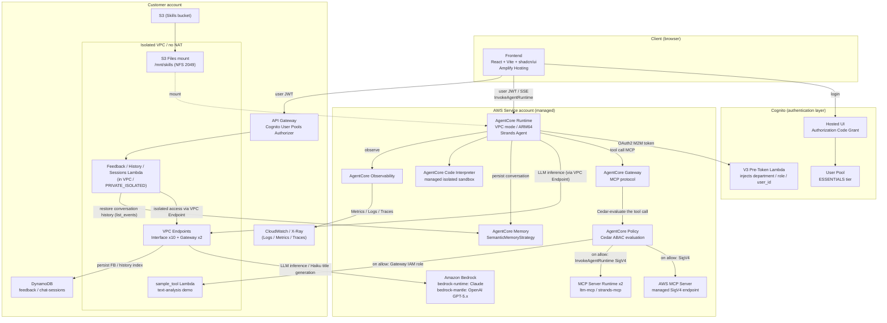
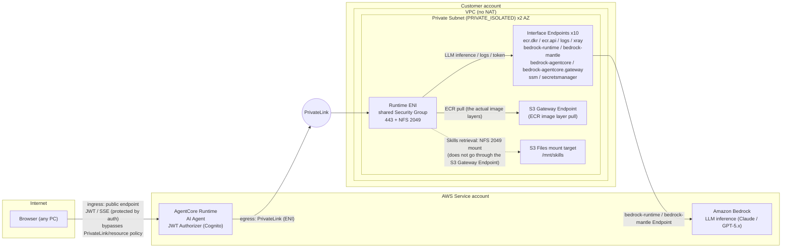
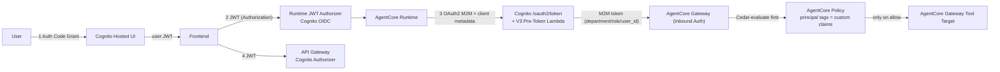
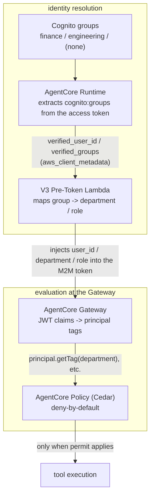
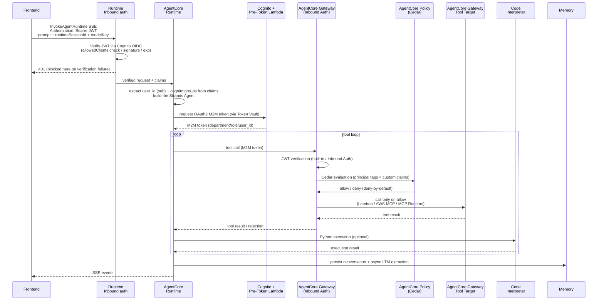
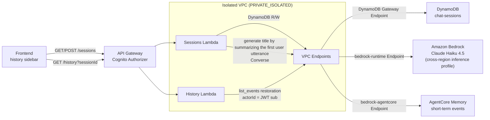
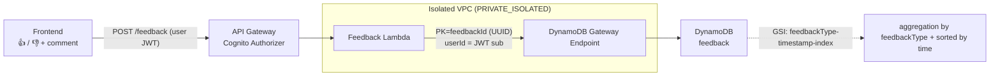
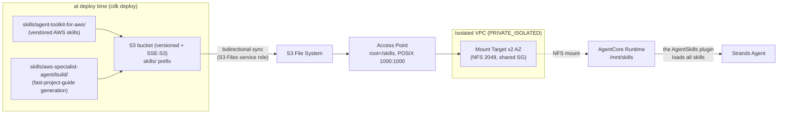
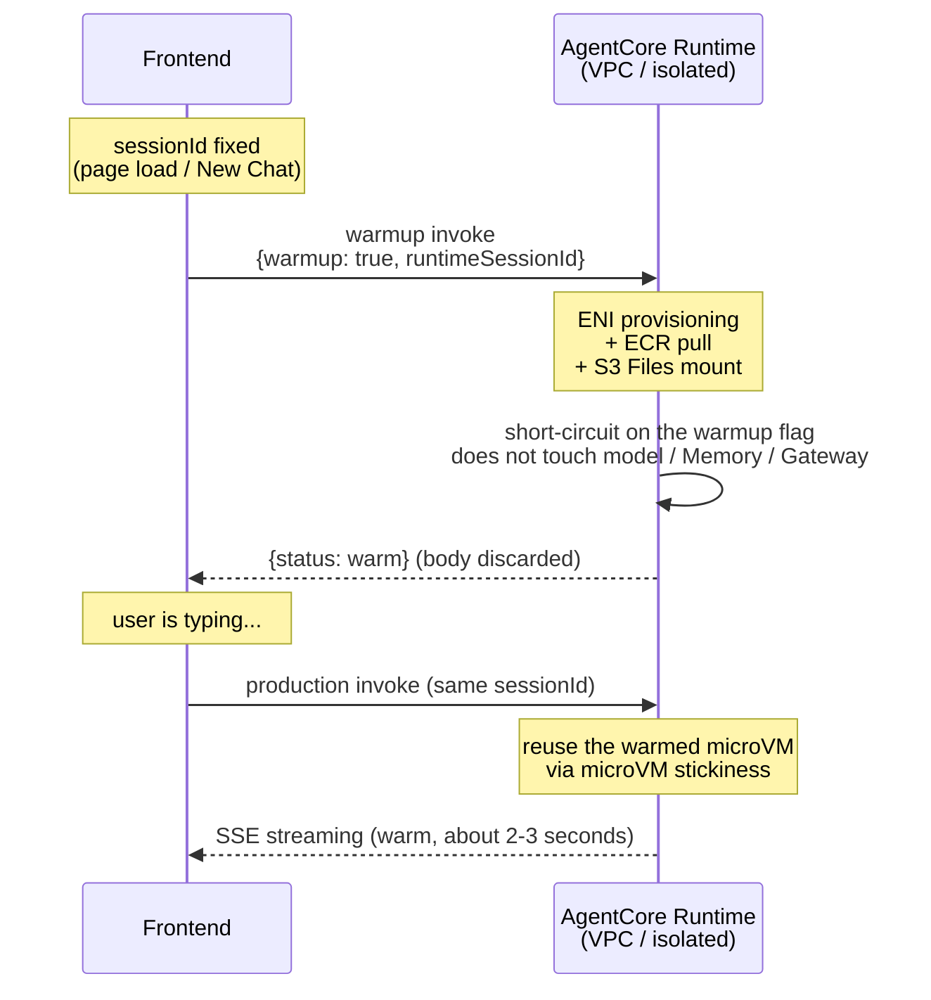

# Architecture

This project is based on the AWS-provided FAST (Fullstack AgentCore Solution Template) as a scaffold, then heavily reworked from there. In particular, the architecture diverges fundamentally from the upstream template in three areas: networking (fully isolated network plus a set of VPC Endpoints), conversation-history title display (API Gateway + DynamoDB + AgentCore Memory restoration), and the addition of the MCP Servers in use (ltm-mcp / strands-mcp). Every diagram below was drawn using the actual CDK code under `infra-cdk/lib/` as the primary source.

## AWS Architecture


## Overall System Configuration

The logical data flow is as follows.



From the user's perspective, the configuration is "one Cognito auth layer + one AgentCore Runtime + one AgentCore Gateway + one AgentCore Memory + an Amplify-Hosted frontend," and it stands up with a single `cdk deploy`. On top of that, it also carries an auxiliary API (API Gateway + Lambda + DynamoDB) responsible for conversation history and feedback, plus a configuration that hosts the MCP Servers under the Gateway as separate Runtimes.

| Component        | Implementation                                                      | Role                                                                                                                                                                       |
| ---------------- | ------------------------------------------------------------------- | -------------------------------------------------------------------------------------------------------------------------------------------------------------------------- |
| Frontend         | React + Vite + shadcn/ui (Amplify Hosting)                          | Chat UI, SSE streaming reception, history sidebar, model selector                                                                                                          |
| Authentication   | Cognito User Pool + Hosted UI                                       | User login (Authorization Code Grant); custom-claim injection via the V3 Pre-Token Lambda                                                                                  |
| Agent runtime    | AgentCore Runtime (VPC mode, ARM64 container)                       | Hosting of the Strands Agent (basic_agent.py), JWT verification                                                                                                            |
| Tool aggregation | AgentCore Gateway                                                   | Provides a Lambda target plus 3 MCP server targets to the Agent over the MCP protocol. ABAC via Cedar policies                                                             |
| Memory           | AgentCore Memory (SemanticMemoryStrategy)                           | Short-term (within a session) + long-term (/facts/{actorId} namespace)                                                                                                     |
| Skill delivery   | S3 bucket + S3 Files -> /mnt/skills mount                           | 43 AWS skills + this fast-project-guide skill                                                                                                                              |
| Code execution   | AgentCore Code Interpreter (official strands_tools tool)            | Python execution in an AWS-managed isolated sandbox (not inside the Runtime VPC)                                                                                           |
| Auxiliary API    | API Gateway + Lambda (in the isolated VPC) + DynamoDB               | Feedback persistence, conversation-history restoration (for the sidebar). The Lambdas run in the same isolated VPC as the Runtime and reach AWS services via VPC Endpoints |
| Networking       | Dedicated VPC (Private Subnet x 2 AZ) + Interface/Gateway Endpoints | An isolated, no-NAT configuration. The Runtime's S3 Files mount / ECR pull / Bedrock inference all go through VPC Endpoints                                                |

## Feature Highlights (quick-reference for presenters)

This lists the features introduced in each of the following sections, in the order they are presented. A star marks the "three major reworks from the upstream FAST template" mentioned in the introduction. Framing the discussion around each row's "showpiece (differentiator to show in a demo)" makes it easier to build a narrative.

| Section                                  | In one sentence                                                                                     | Showpiece (differentiator to show in a demo)                                                                                                                                                                                                                                                  |
| ---------------------------------------- | --------------------------------------------------------------------------------------------------- | --------------------------------------------------------------------------------------------------------------------------------------------------------------------------------------------------------------------------------------------------------------------------------------------- |
| Networking (isolated VPC)                | Egress is fully isolated with no NAT. Ingress is public + JWT authentication                        | Being able to route all egress through VPC Endpoints and remove NAT (by moving per-user authorization onto the M2M token). Interface x10 + Gateway x2 are all actually used. Because this is a public demo, the ingress carries no resource policy and is protected by authentication instead |
| The 4 authentication/authorization flows | 4 JWT/OAuth2 flows spanning User / Runtime / Gateway / API GW                                       | The way Runtime->Gateway injects verified claims (department/role/user_id) into the M2M token                                                                                                                                                                                                 |
| Gateway target configuration             | 5 kinds of tool targets (Lambda / AWS MCP / ltm-mcp / strands-mcp / web-search) aggregated over MCP | Fully managed web-search (zero data egress), and tenant propagation via the actor-id header (ltm-mcp)                                                                                                                                                                                         |
| ABAC via AgentCore Policy                | Cedar performs ABAC evaluation using department/role derived from Cognito groups                    | Destructive AWS tools are limited to finance + deny-by-default. Identifiers come from M2M claims and cannot be spoofed                                                                                                                                                                        |
| Request flow (one turn)                  | The full picture of a single turn from InvokeAgentRuntime through SSE streaming                     | Cedar is evaluated on every pass through the tool loop, and long-term memory extraction runs asynchronously after the response                                                                                                                                                                |
| Model selection (multi-model support)    | Switch between the Claude 4 generation + two OpenAI GPT generations in the UI                       | A Strands factory (models.py) dispatches BedrockModel / OpenAIResponsesModel by provider. OpenAI uses the bedrock-mantle Responses API and, since it became available in us-east-1 (2026-06), is directly connected within the isolated network                                               |
| Conversation history (title display)     | The history list in the sidebar and restoration of the body                                         | A two-tier design: the body in Memory, the index in DynamoDB. Titles are Haiku summarizing the first turn into 8 words (falling back to truncation on failure)                                                                                                                                |
| Feedback mechanism                       | Accumulates thumbs up/down and comments into DynamoDB (a sample implementation from FAST)           | A design that is easy to aggregate via a GSI (feedbackType-timestamp). userId comes from the JWT sub and cannot be spoofed                                                                                                                                                                    |
| Skills mount via S3 Files                | NFS-mounts 44 skills at `/mnt/skills`                                                               | Skills can be updated without rebuilding the container. This is the primary reason the Runtime is in VPC mode                                                                                                                                                                                 |
| warmup technique                         | Speculatively starts a microVM in the background while the user is typing                           | A pre-warm that hides cold start (about 25 seconds) behind the UX. Extending the idle timeout to 3600 seconds also suppresses re-triggering a cold start                                                                                                                                      |

## Networking (isolated VPC)

The diagram below maps the patterns from the AWS blog "[Network connectivity patterns for agents on Amazon Bedrock AgentCore Runtime](https://aws.amazon.com/jp/blogs/networking-and-content-delivery/network-connectivity-patterns-for-agents-deployed-on-amazon-bedrock-agentcore-runtime/)" onto this project's actual endpoint configuration. This project is a hybrid configuration that combines the blog's patterns, using different approaches for ingress (the entry point that invokes the Runtime) and egress (the Runtime's access to AWS services).

- **Egress (data plane) is fully isolated, equivalent to Pattern 4**: The AgentCore Runtime runs on the AWS Service account side and egresses to the Customer account's VPC only via PrivateLink (ENI). The VPC has no NAT (`natGateways: 0`), and the private tier is `PRIVATE_ISOLATED` (no route to the internet exists). All AWS access from the Runtime onward (Bedrock inference / ECR pull / S3 Files mount / DynamoDB / Logs / Token Vault) goes through VPC Endpoints.
- **Ingress is Pattern 1 (public endpoint + authentication)**: The entry point from the browser to the Runtime is a public endpoint and involves neither PrivateLink nor a resource-based policy. It is reachable from the internet and is protected by authenticating the Cognito JWT (the Runtime's JWT Authorizer). A resource-based policy that narrows inbound access to specific VPCs / IPs / VPC Endpoints (the blog's Pattern 3) is **intentionally not adopted**. Because this is a public demo that must be accessible from any PC, attaching a resource policy would block visitors' PCs across the board (ingress is designed to be "protected by authentication," not "closed off by the network").

In other words, what can be called "fully isolated (Pattern 4)" is the egress side; the ingress (the entry point that invokes the Runtime) remains public and is protected by authentication.



Because of the S3 Files mount constraint, the Runtime runs in VPC mode. It is a no-NAT configuration in a dedicated VPC (default CIDR 10.20.0.0/16) with Private Subnets x 2 (pinned to AgentCore-supported AZs, `PRIVATE_ISOLATED`), a set of Interface Endpoints, and S3/DynamoDB Gateway Endpoints; this is what provides the isolation on the egress side. NAT could be removed because per-user authorization was changed to a scheme where "the Runtime reads cognito:groups from the access token and puts them onto the M2M token via the Token Vault (bedrock-agentcore endpoint)," which removed any reason for the Runtime to reach out to the public Cognito hosted domain. The S3 Files NFS mount (2049) reaches the ENI of the mount target created inside the VPC directly from within the same VPC (unlike API calls such as S3 / DynamoDB, this is not traffic that goes through a VPC Endpoint). As a cold-start mitigation, the idle timeout is extended to 3600 seconds, and the frontend performs a speculative pre-warm with a warmup payload as soon as the session ID is fixed. This speculative pre-warm is modeled on the "Pre-warming instances through strategic pinging" pattern in the AWS re:Post article "[Minimizing startup latency with Amazon Bedrock AgentCore Runtime](https://repost.aws/articles/ARCJIn3t7aRC2FxiRTV1SuCA)" (issue a session ID and send a ping at the moment the user opens the app, warming up the instance bound to that session ID before the first request).

This demo unifies the data plane (egress) to be fully isolated. In addition to the Runtime and the MCP Server Runtimes, the auxiliary Lambdas responsible for conversation history and feedback (Feedback / History / Sessions) are also housed in the same PRIVATE_ISOLATED subnets and the same shared Security Group, and each reaches the AWS services it calls via VPC Endpoints. Specifically, the Feedback / Sessions Lambdas' DynamoDB access goes through the DynamoDB Gateway Endpoint, the Sessions Lambda's Haiku title generation through the bedrock-runtime Interface Endpoint, and the History Lambda's conversation-body restoration (AgentCore Memory's `list_events`) through the bedrock-agentcore Interface Endpoint. The S3 Gateway Endpoint is used for the Runtime's ECR image layer pull (because the actual ECR image layers are stored in S3, they cannot be pulled with only the `ecr.api` / `ecr.dkr` Interface Endpoints; reaching S3 is required). Note that the path by which the Runtime retrieves Skills is not this S3 Gateway Endpoint but the NFS mount (2049) at `/mnt/skills` (as described above, it reaches the mount target's ENI directly and does not go through the S3 API). The S3 Gateway Endpoint relates to Skills only in the S3-API-based parts: the `BucketDeployment` at deploy time and the bidirectional sync of S3 Files (bucket <-> File System). This puts all endpoints deployed for isolation into an actually-used state, and the auxiliary API also never goes out to the internet. On the ingress (entry) side, meanwhile, both the frontend's (browser's) invocation of the Runtime and the calls to API Gateway (the feedback/history API) are public endpoints protected by the Cognito JWT (because the frontend is an SPA on Amplify Hosting and this is a public demo accessed from any PC).

## The 4 Authentication/Authorization Flows

1. **User -> Frontend**: The Cognito User Pool's Authorization Code Grant. The user logs in at the Cognito Hosted UI and obtains a JWT.
2. **Frontend -> AgentCore Runtime**: The user JWT is sent in the Authorization header, and the Runtime's JWT Authorizer (Cognito OIDC) verifies it.
3. **Runtime -> AgentCore Gateway**: OAuth2 Client Credentials (M2M). When the Runtime calls Cognito's /oauth2/token, it passes the verified user ID in aws_client_metadata, and the V3 Pre-Token Lambda injects the department / role / user_id custom claims into the M2M token. A tool call to the Gateway first arrives at the AgentCore Policy (Cedar Policy Engine) attached to the Gateway, and the Policy evaluates those custom claims as principal tags to decide allow / deny (ABAC). Only on allow does the Gateway invoke the actual target.
4. **Frontend -> API Gateway** (feedback/history API): The user JWT is verified by the Cognito User Pools Authorizer.



A tool call is not handled by the AgentCore Gateway alone; the AgentCore Policy (Cedar Policy Engine) attached to the Gateway evaluates it first. After the Gateway performs its built-in JWT verification, the Policy evaluates Cedar rules against the principal tags (custom claims), and only on allow does it reach the actual target (this configuration is a policy-only pattern that does not use a Lambda interceptor). department is derived from the Cognito group name (finance / engineering); a user belonging to no group falls back to "guest," and Cedar's deny-by-default rejects all tools. finance maps to role=admin and is the only department allowed to use the destructive AWS MCP tools (aws***call_aws / aws***run_script).

## Gateway Target Configuration

| Target             | Type                 | Provided tools                                                                                                                                                                               |
| ------------------ | -------------------- | -------------------------------------------------------------------------------------------------------------------------------------------------------------------------------------------- |
| sample-tool-target | Lambda               | text_analysis_tool: a demo tool for text analysis (word count / character frequency)                                                                                                         |
| aws-mcp            | MCP (SigV4)          | aws\_\_\_search_documentation, aws\_\_\_read_documentation, aws\_\_\_list_regions, aws\_\_\_get_regional_availability, aws\_\_\_retrieve_skill, aws\_\_\_call_aws, aws\_\_\_run_script, etc. |
| ltm-mcp            | MCP (Runtime-hosted) | list_long_term_memories (meta-recall via a full enumeration of long-term memories)                                                                                                           |
| strands-mcp        | MCP (Runtime-hosted) | search_docs / fetch_doc (official Strands Agents SDK documentation)                                                                                                                          |
| web-search-tool    | MCP (Connector)      | WebSearch (Amazon-managed web search. Retrieves up-to-date information with citations)                                                                                                       |

sample_tool (target name `sample-tool-target`) registers a Lambda inside the isolated VPC (PRIVATE_ISOLATED) as a Gateway Lambda target. Because the Gateway calls this target via the Lambda Invoke API (SigV4), it can reach the Lambda even though the Lambda is in the isolated VPC, and no additional network configuration is needed on the Gateway side. The AWS MCP Server registers an AWS-managed SigV4 endpoint (service name "aws-mcp") as an MCP server target. ltm-mcp and strands-mcp are a configuration in which a FastMCP server hosted on its own dedicated AgentCore Runtime is registered as a Gateway target; the Gateway calls them via `InvokeAgentRuntime` (SigV4) through the bedrock-agentcore endpoint.

web-search (target name `web-search-tool`) registers **AgentCore Web Search**, which reached GA in 2026, as a built-in connector target of the Gateway (`connectorId: "web-search"`). Unlike the previous three kinds, it is a fully managed tool that needs neither a self-hosted Lambda or Runtime nor a key for an external search API (Tavily / Brave, etc.); it uses an Amazon-operated web index (on the order of tens of billions of documents) and a knowledge graph, and the search query is completed within AWS (zero data egress). The agent discovers the `WebSearch` tool via `tools/list` (inputs are query [up to 200 characters] and an optional maxResults [1-25]), retrieves up-to-date information with citations, and backs up its answers. Because the Gateway calls the built-in connector with the `GATEWAY_IAM_ROLE`, the Gateway service role is granted `bedrock-agentcore:InvokeGateway` and `bedrock-agentcore:InvokeWebSearch` (scoped to the service-owned ARN `arn:aws:bedrock-agentcore:<region>:aws:tool/web-search.v1`). Availability is us-east-1 only (as of 2026-06), and the only additional charge is the Gateway's data transfer. Note that Web Search's Acceptable Use requires displaying citations (title / URL) in answers that use search results, which is enforced by including an instruction in the agent's system prompt to "always cite sources when using WebSearch results."

The MCP server targets also have a mechanism to propagate tenant (user) information. Because the Gateway does not forward the inbound JWT claims to the MCP server as-is, the verified user ID is placed in the `X-Amzn-Bedrock-AgentCore-Runtime-Custom-Actor-Id` header (the only custom header prefix that AgentCore passes through to the Runtime container) and passed through a two-stage allowlist: the Gateway target's `metadataConfiguration.allowedRequestHeaders` and the MCP server Runtime's `allowlistedHeaders`. This safely conveys "whose request this is" to the MCP servers under the Gateway. The one that actually uses this is ltm-mcp: it identifies the `/facts/{actor_id}` namespace from the propagated actor ID and enumerates only that user's own long-term memories. Because the actor ID is not a model-specified value but a verified identity derived from the header, memories of other users cannot be read (strands-mcp does not use this header, since public documentation search needs no tenant information).

## ABAC via AgentCore Policy

Tool access control is performed with ABAC (Attribute-Based Access Control) based on the user's attributes (department / role). The attributes are derived deterministically from Cognito group membership rather than from the LLM or application logic, and the AgentCore Policy (Cedar) in front of the Gateway evaluates them. The key is the flow of "moving the user identity onto the M2M token's custom claims, and evaluating them as Cedar principal tags."



The department / role mapping is fixed in the Pre-Token Lambda's `GROUP_ROLES` (finance -> admin, engineering -> developer; a user belonging to no group is guest -> viewer). Each Cedar policy is written as a single statement that "permits a specific action (tool) only when the principal's department tag is in the allow list," and any request that does not match a permit is rejected deny-by-default. Tool access by department is as follows.

| Tool (action)                                                                                            | finance | engineering | guest | Policy                       |
| -------------------------------------------------------------------------------------------------------- | ------- | ----------- | ----- | ---------------------------- |
| sample_tool (text_analysis_tool)                                                                         | allow   | allow       | deny  | 01-sample-tool.cedar         |
| AWS MCP read family (search/read_documentation, list_regions, retrieve_skill, get_regional_availability) | allow   | allow       | deny  | 02-aws-mcp-read.cedar        |
| AWS MCP destructive family (aws***call_aws, aws***run_script)                                            | allow   | deny        | deny  | 03-aws-mcp-destructive.cedar |
| ltm-mcp (list_long_term_memories)                                                                        | allow   | allow       | deny  | 04-ltm-mcp.cedar             |
| strands-mcp (search_docs, fetch_doc)                                                                     | allow   | allow       | deny  | 05-strands-mcp.cedar         |
| web-search (WebSearch)                                                                                   | allow   | allow       | deny  | 06-web-search.cedar          |

Only destructive AWS operations (arbitrary AWS API calls and Python script execution) are limited to finance (role=admin), enforcing least privilege. Because the identifiers are taken from the M2M token's verified claims, a user cannot spoof department in the request body (cognito:groups is proven by the access token). Each Cedar file is split into "one statement per file" due to the constraints of the AgentCore CreatePolicy API.

## Request Flow (one turn)



1. The frontend sends prompt + runtimeSessionId + modelKey with `Authorization: Bearer <Cognito JWT>` to the public InvokeAgentRuntime (SSE) endpoint.
2. **Runtime Inbound authentication**: The JWT Authorizer configured on the AgentCore Runtime (`RuntimeAuthorizerConfiguration.usingJWT(Cognito OIDC)`) verifies the JWT on the platform side (checking the signature, expiration, and `allowedClients` with the public key obtained from Cognito's `.well-known/openid-configuration`). Requests that fail verification are rejected here and never reach the handler. The verified claims are passed as context, and the handler extracts `sub` (user_id) and `cognito:groups` and builds the Strands Agent (model resolution -> Gateway MCP client -> Memory session manager -> AgentSkills plugin).
3. The Agent runs the tool loop. For a Gateway tool call, it passes the verified tenant information obtained from Inbound authentication in step 2 (department / role derived from user_id / cognito:groups) to the V3 Pre-Token Lambda via `aws_client_metadata`, and **injects department / role / user_id into the custom claims of the M2M token** issued by Cognito's `/oauth2/token` (Client Credentials). The AgentCore Policy on the Gateway side evaluates these claims as Cedar principal tags (ABAC), and only targets permitted under deny-by-default are invoked. Because the tenant information comes from the verified JWT rather than the request body, it cannot be spoofed. The Code Interpreter / file_read / skills are also used in this loop.
4. Events are slimmed down (forwarding only the keys the frontend's parser reads) and streamed over SSE.
5. Conversation persistence to Memory and asynchronous long-term memory extraction (SemanticStrategy) run.

In other words, the Runtime Inbound and the Gateway Inbound have a symmetric structure. Both are designed so that a built-in JWT Authorizer completes verification "**before reaching the actual code**": the Runtime side verifies the user JWT (Cognito User Pool client), and the Gateway side verifies the M2M JWT (machine client, containing verified claims). The reason no resource-based policy is used in the isolated configuration (a public-demo requirement) is premised on this "protected by Inbound authentication" design.

## Model Selection (multi-model support)

The upstream FAST template was fixed to a single model, but this demo lets you switch between models from multiple providers and multiple generations via the UI's model selector. The current lineup is Claude (Fable 5 / Opus 4.8 / Sonnet 5 / Sonnet 4.6 / Haiku 4.5) plus two OpenAI GPT generations (GPT-5.5 / GPT-5.4), 7 models in total, with Sonnet 4.6 as the default.

| Model             | provider  | Physical path                         | Inference profile                      | Default |
| ----------------- | --------- | ------------------------------------- | -------------------------------------- | ------- |
| Claude Fable 5    | anthropic | bedrock-runtime / Converse            | Global cross-region (`global.` prefix) |         |
| Claude Opus 4.8   | anthropic | bedrock-runtime / Converse            | Global cross-region                    |         |
| Claude Sonnet 5   | anthropic | bedrock-runtime / Converse            | Global cross-region                    |         |
| Claude Sonnet 4.6 | anthropic | bedrock-runtime / Converse            | Global cross-region                    | ✓       |
| Claude Haiku 4.5  | anthropic | bedrock-runtime / Converse            | Global cross-region                    |         |
| OpenAI GPT-5.5    | openai    | bedrock-mantle / OpenAI Responses API | In-Region (us-east-1)                  |         |
| OpenAI GPT-5.4    | openai    | bedrock-mantle / OpenAI Responses API | In-Region (us-east-1)                  |         |

Model selection and construction are confined to a thin Strands factory (`agent/strands-single-agent/models.py`), and the agent itself (`basic_agent.py`) is unaware of the model implementation details. What the frontend puts on the invoke payload is only a logical key (e.g. `opus-4.8`), and this module is also what resolves it into a physical Bedrock model id and provider. The allowlist that resolution is based on (`MODEL_MAP`) and the default key (`DEFAULT_MODEL_KEY`) are injected via environment variables from the CDK model registry (`infra-cdk/lib/utils/model-registry.ts`), and because the frontend's selector options also come from the same registry, the FE and BE model lists never drift apart.

Key resolution has two stages. First, `resolve_model(requested_key)` treats the frontend-supplied key as untrusted client input (in contrast to the user identity, which comes from a verified JWT, the key rides in the request body) and always checks it against the allowlist (the keys of `MODEL_MAP`) before assembling a model. Unknown or forged keys are rejected with a `ValueError` and never reach Bedrock; only when the value is `None` does it fall back to `DEFAULT_MODEL_KEY`, and an empty string is explicitly rejected rather than silently defaulted (fail-loudly). Next, `build_model(resolved)` dispatches the Strands model class by provider.

- **`provider == "anthropic"`** -> `BedrockModel(model_id=...)`. This is the standard path using bedrock-runtime's Converse. Only Fable 5 requires, as an operational precondition, that the caller region's data retention mode be `provider_data_share`.
- **`provider == "openai"`** -> `OpenAIResponsesModel(...)`. Because GPT-5.x is provided via bedrock-mantle's OpenAI Responses API rather than bedrock-runtime, it uses a different Strands class and a different authentication path than Claude.

There are three key points to constructing the OpenAI-side `OpenAIResponsesModel`.

```python
return OpenAIResponsesModel(
    model_id=resolved["id"],                     # openai.gpt-5.5 / openai.gpt-5.4
    stateful=False,                              # (1) required
    client_args={
        "api_key": provide_token(region=region), # (2) short-lived bearer token
        "base_url": _mantle_base_url(region),     # (3) /openai/v1 path required
    },
)
```

1. **`stateful=False` is required**. A stateful Responses model manages conversation history on the server side and throws an exception if a conversation manager is passed. Because this agent always passes an `AgentCoreMemorySessionManager`, with stateful=True the history restoration by AgentCore Memory would silently break.
2. **Authentication is a short-lived bearer token**. `aws_bedrock_token_generator.provide_token(region=...)` generates a short-lived token from the Runtime's own credentials and passes it as `api_key`. It holds no stored API key that would need rotation.
3. **`base_url` is `https://bedrock-mantle.{region}.api.aws/openai/v1`**. The `/openai/v1` prefix is required and `/v1` is rejected. The region is taken from `os.environ["AWS_REGION"]` (the Runtime's own region), and if unset, it fails loudly with a KeyError. GPT-5.x inference is In-Region only and does not support Geo / Global inference profiles.

`temperature` is not passed to any model. Because the current generation rejects temperature (Claude Opus 4.8 / Fable 5 with a ValidationException, GPT-5.5 with a 400), all models run at their provider defaults. The Strands model classes are lazily imported within this factory, so using only Claude does not require the openai extra, and the module (and its unit tests) can be loaded even when Strands is not installed.

### Assembling the Strands Agent

The model returned by `build_model()` is plugged directly into the Strands `Agent` in `create_strands_agent()` in `basic_agent.py`. Whether it is a `BedrockModel` or an `OpenAIResponsesModel`, the form passed to `Agent(model=...)` is the same; because Strands abstracts the model interface, the agent itself is unaware of the provider difference. On each turn, one agent is built by passing the user_id / groups taken from the verified JWT and the allowlist-verified resolved model.

```python
bedrock_model = build_model(resolved_model)  # BedrockModel or OpenAIResponsesModel
session_manager = _create_session_manager(user_id, session_id)  # AgentCore Memory
gateway_client = create_gateway_mcp_client(user_id, groups)     # Gateway MCP (Cedar ABAC)
code_interpreter_tool = AgentCoreCodeInterpreter(region=region, session_name=session_id)

return Agent(
    name="strands_agent",
    system_prompt=SYSTEM_PROMPT,
    tools=[gateway_client, code_interpreter_tool.code_interpreter, file_read],
    plugins=_build_plugins(),          # AgentSkills if skills are mounted
    model=bedrock_model,               # provider differences already absorbed here
    session_manager=session_manager,
    trace_attributes={"user.id": user_id, "session.id": session_id},
)
```

In this way, the Strands `Agent` is a configuration that bundles "model + system prompt + tools (Gateway MCP client / Code Interpreter / file_read) + plugins (AgentSkills) + session_manager (AgentCore Memory) + trace attributes" in one place. The entry point (`invocations` under `@app.entrypoint`), after short-circuiting on the warmup flag, builds an agent with this factory per request and returns each event of `agent.stream_async()` over SSE, slimmed down to only the keys the frontend's parser reads. Swapping the model is just "changing the logical key the frontend sends"; none of the agent-assembly code changes at all.

### OpenAI Model Availability Regions and Timing

OpenAI's GPT-5.5 / GPT-5.4 launched on 2026-06-01 and became GA (generally available) on Amazon Bedrock in the same 2026-06 ("[GPT-5.5, GPT-5.4, and Codex from OpenAI are now generally available on Amazon Bedrock](https://aws.amazon.com/about-aws/whats-new/2026/06/amazon-bedrock-openai-models-codex-generally-available/)"). Both are provided via the bedrock-mantle endpoint (`https://bedrock-mantle.{region}.api.aws/openai/v1`, model ids `openai.gpt-5.5` / `openai.gpt-5.4`) and support a 272K-token context and text + image input.

This project's primary region is us-east-1, but initially GPT-5.x was not available in us-east-1. For that reason, we first adopted a cross-region configuration where we "stood up a minimal VPC in us-east-2 and reached that region's bedrock-mantle endpoint from the isolated VPC in us-east-1 via VPC peering." Later, in 2026-06, GPT-5.4 / GPT-5.5 became available in us-east-1 (N. Virginia) as well ("[OpenAI GPT-5.4 and GPT-5.5 models now available in US East (N. Virginia) on Amazon Bedrock](https://aws.amazon.com/jp/about-aws/whats-new/2026/06/openai-gpt-us-east-virginia-amazon/)"), which eliminated the reason for the cross-region configuration to exist, so we simplified to a direct connection to the same-region bedrock-mantle endpoint in us-east-1. As a result, both Claude and OpenAI now complete within us-east-1, and full isolation is maintained.

The current (2026-06) availability regions for OpenAI GPT-5.x are as follows (sourced from each model card; both are In-Region only and do not support Geo / Global cross-region inference).

| Model   | In-Region availability                                                                  |
| ------- | --------------------------------------------------------------------------------------- |
| GPT-5.5 | us-east-1 (N. Virginia), us-east-2 (Ohio)                                               |
| GPT-5.4 | us-east-1 (N. Virginia), us-east-2 (Ohio), us-west-2 (Oregon), us-gov-west-1 (GovCloud) |

GPT-5.4 has broader regional availability, and us-east-1 (which this demo uses) is covered for both models. On the Claude side, the Global cross-region inference profile (`global.` prefix) is used, so it can be reached without being bound to a specific region's availability.

## How Conversation History (title display) Works

One of the reworks that was not in the upstream FAST template is the conversation-history list in the sidebar and its restoration.



This is a two-tier design where the conversation body itself is stored in AgentCore Memory, and the DynamoDB chat-sessions table holds only the per-user "index" (the session list and titles). When you open a past session in the sidebar, the History Lambda calls AgentCore Memory's ListEvents API to fetch the short-term events, reorders them chronologically, and restores the body. The actorId used here is not a value from the request body but the sub claim of the JWT that API Gateway's Cognito User Pools Authorizer verified. As a result, a user can always open only their own history and cannot spoof actorId to read someone else's conversation.

The title is generated by the Sessions Lambda. It calls Amazon Bedrock's Claude Haiku 4.5 (`us.anthropic.claude-haiku-4-5-20251001-v1:0`, cross-region inference profile) via the Converse API to summarize the first user utterance into a heading of 8 words or fewer, and saves it to DynamoDB. Title generation does not wait for the agent's answer; the frontend fires POST /sessions immediately after the user sends a message. As a result, the title is not affected by the answer's length, latency, or failure, and a heading is attached to the sidebar immediately (the old implementation, which passed the answer body to title generation, had a bug where a long answer would be rejected for exceeding the request limit and no title would be attached). If the Haiku call fails (or the response is empty), it falls back to the first user message, truncating to the first 40 characters + an ellipsis (`…`) if it exceeds 40 characters, so that title generation never blocks the conversation itself. Even if the utterance is too long, it is not rejected but truncated at the head and passed to summarization (POST /sessions is idempotent and does not regenerate an existing sessionId). These auxiliary Lambdas are housed in the same isolated VPC as the Runtime and reach DynamoDB / Bedrock / AgentCore Memory entirely via VPC Endpoints.

## How Feedback Works

This is a mechanism where the user submits whether an answer was good or bad (thumbs up / down) and it accumulates into DynamoDB. This is a sample implementation of application-data persistence that also exists in the upstream FAST template, retained as a best-practice example of API Gateway + Lambda + DynamoDB.



When the frontend sends the answer's rating (`positive` / `negative`), an optional comment, the target message, and the sessionId to POST /feedback, the Feedback Lambda extracts userId (the JWT sub) from the Cognito Authorizer's claims and saves it to the DynamoDB feedback table with a UUID feedbackId as the partition key. The Feedback Lambda is also placed in the same isolated VPC as the Runtime and writes to DynamoDB via the DynamoDB Gateway Endpoint. The table has a GSI (feedbackType-timestamp-index) with feedbackType as the partition key and timestamp as the sort key, making it easy to aggregate positive and negative feedback chronologically. The request body is validated with Pydantic (the character set of sessionId, the maximum length of each field), and userId is taken from the verified JWT rather than the body, so it cannot be spoofed.

## Networking (VPC) Supplement

The dedicated VPC has one self-referencing shared Security Group, so that the Runtime ENI / auxiliary Lambda ENIs / each Endpoint ENI / S3 Files mount target can reach each other over 443 (HTTPS) and 2049 (NFS). There are 10 kinds of Interface Endpoints (ecr.dkr / ecr.api / logs / xray / bedrock-runtime / bedrock-mantle / bedrock-agentcore / bedrock-agentcore.gateway / ssm / secretsmanager) and 2 kinds of Gateway Endpoints (s3 / dynamodb), all of which are actually used (a `bedrock-agent-runtime` endpoint for the old Bedrock Agents used to be present, but was confirmed unused in three ways -- static, dynamic, and documentary -- and deleted). s3 is used by the Runtime's ECR layer pull and Skills sync; dynamodb by the auxiliary Lambdas' (Feedback / Sessions) access to the chat-sessions / feedback tables; bedrock-runtime by the Sessions Lambda's Haiku title generation; and bedrock-agentcore by the History Lambda's Memory `list_events`. **bedrock-agentcore.gateway is the endpoint for isolated Private DNS resolution of the Runtime -> AgentCore Gateway MCP connection (host `*.gateway.bedrock-agentcore.<region>.amazonaws.com`), and the bulk of tool calls (all MCP server targets) go through it. It has been verified on a validation branch that removing it prevents the Runtime from resolving the Gateway URL, causing MCP client initialization to fail for all targets with `ConnectError: [Errno -2] Name or service not known`**. bedrock-mantle is the endpoint for delivering OpenAI GPT-5.x with a direct connection in us-east-1. The AZs must be pinned to the AZ IDs supported by AgentCore Runtime VPC mode; in an unsupported AZ, resource creation fails.

## Skills Mount via S3 Files

The skills (43 AWS skills + this fast-project-guide skill) are NFS-mounted at `/mnt/skills` via **AgentCore Runtime's S3 Files feature**, rather than baked into the container image. S3 Files is an AWS mechanism that exposes an S3 bucket as an NFS-mountable file system and automatically syncs the bucket and file system bidirectionally (the S3 bucket is the source of truth on conflict). This means that when skills are updated, the Runtime container does not need to be rebuilt: skills placed in the bucket are visible directly from `/mnt/skills`, and Strands' AgentSkills plugin loads all skills from this single path at startup. This S3 Files mount is the primary reason the Runtime is in VPC mode (because the NFS mount target's ENI must be inside the VPC).



Key points of the implementation (the implementation is in `infra-cdk/lib/skills-storage-stack.ts`):

- **Bucket**: versioning enabled + SSE-S3 (a prerequisite for S3 Files). The two sources -- `skills/agent-toolkit-for-aws/` (vendored AWS skills) and `skills/aws-specialist-agent/build/` (fast-project-guide) generated at synth time -- are placed under the `skills/` prefix via `BucketDeployment` (`prune: true`). Because the fast-project-guide is regenerated at deploy time, any generation failure fails synth itself, so a stale guide is never shipped.
- **File System + service role**: Create the S3 Files File System and auto-sync it with the skills bucket (as described above, S3 Files exposes the bucket as an NFS-mountable file system and syncs bidirectionally with the bucket as the source of truth; specify the skills bucket's ARN in `CfnFileSystem`'s `bucket`). The IAM role for sync trusts `elasticfilesystem.amazonaws.com` and is granted S3 read/write + EventBridge management permissions (KMS permissions are unnecessary since it is SSE-S3).
- **Mount Target (per AZ)**: Because AgentCore mounts per AZ, create one Mount Target in each of the same Private Subnets as the Runtime ENI. The shared SG allows 2049 (NFS) via self-reference.
- **Access Point**: Fix the root to `/skills` and set the POSIX identity to `1000:1000` (matching the `bedrock_agentcore` user in the Dockerfile). From the Runtime, it appears flatly as `/mnt/skills`.
- **Mount wiring to the Runtime**: Because the L2 Runtime does not yet surface `filesystemConfigurations`, set the Access Point ARN and mount path on the L1 (`CfnRuntime`) with `addPropertyOverride("FilesystemConfigurations", ...)`. The Runtime execution role is granted `s3files:ClientMount` / `ClientWrite` (conditioned on the Access Point ARN), plus `s3files:Get*` / `List*`, which are evaluated during Create/Update validation.
- **Dependency ordering**: The File System begins its initial sync only after `BucketDeployment` completes (otherwise the first session could mount an empty `/mnt/skills`). Because of S3 eventual consistency, the first invoke is designed to tolerate a temporarily empty list.

## warmup Technique

Because a VPC-mode AgentCore Runtime provisions an ENI before the microVM starts, its cold start is long, and in the isolated configuration the first invoke that hits a cold start takes about 25 seconds (roughly 10x warm). microVMs are allocated per runtimeSessionId, and there is no notion of pool warming as with Lambda, so a new session's first invoke is unavoidable by configuration. Therefore, we implemented a pre-warm that "speculatively starts a microVM in the background while the user is typing."



The frontend sends `{warmup: true, runtimeSessionId}` with the same session header as the production invoke at the moment the sessionId is fixed (right after page load, after New Chat, or when selecting a past conversation). When the Runtime side (basic_agent.py) sees the warmup flag, it touches neither model resolution, Memory, nor Gateway and simply returns `{"status": "warm"}` immediately, so it can complete only the heavy initialization -- ENI provisioning, ECR pull, S3 Files mount -- in advance without polluting the conversation history. Thanks to microVM stickiness, a production invoke with the same runtimeSessionId is routed to the warmed microVM. The pre-warm is fire-and-forget; even if it fails, the first invoke simply bears the cold start as before. In addition, the idle timeout is extended from the default 15 minutes to 3600 seconds, which also prevents the microVM from terminating during the utterance intervals of a demo and triggering another cold start.

## Primary Sources

- Diagrams: the Mermaid diagrams in this file (overall system / isolated network / authentication flow / one turn / conversation history) and the repo's docs/architecture-diagram/ (drawio + png; images are not included in this mirror)
- Official explanations: repo/docs/GATEWAY.md, repo/docs/RUNTIME_GATEWAY_AUTH.md, repo/docs/IDENTITY_POLICY.md, repo/docs/MEMORY_INTEGRATION.md, repo/docs/DEPLOYMENT.md
- Reference: the AWS blog "Network connectivity patterns for agents on Amazon Bedrock AgentCore Runtime" -- a hybrid where egress is equivalent to Pattern 4 (isolated VPC + VPC Endpoint) and ingress is Pattern 1 (public endpoint + JWT authentication). A resource-based policy that narrows inbound (Pattern 3) is not adopted, due to the public-demo requirement
- Implementation: the stacks under repo/infra-cdk/lib/ (vpc-stack.ts, cognito-stack.ts, backend-stack.ts, etc.), repo/agent/strands-single-agent/basic_agent.py
- Design decisions: network isolation, isolated housing of the auxiliary Lambdas, conversation history, MCP Server additions, Web Search connector addition, Code Interpreter, model selection (multi-model / OpenAI)
- OpenAI models: the AWS model card "OpenAI" (https://docs.aws.amazon.com/bedrock/latest/userguide/model-cards-openai.html); availability regions and GA timing from each GPT-5.x model card and the 2026-06 What's New
