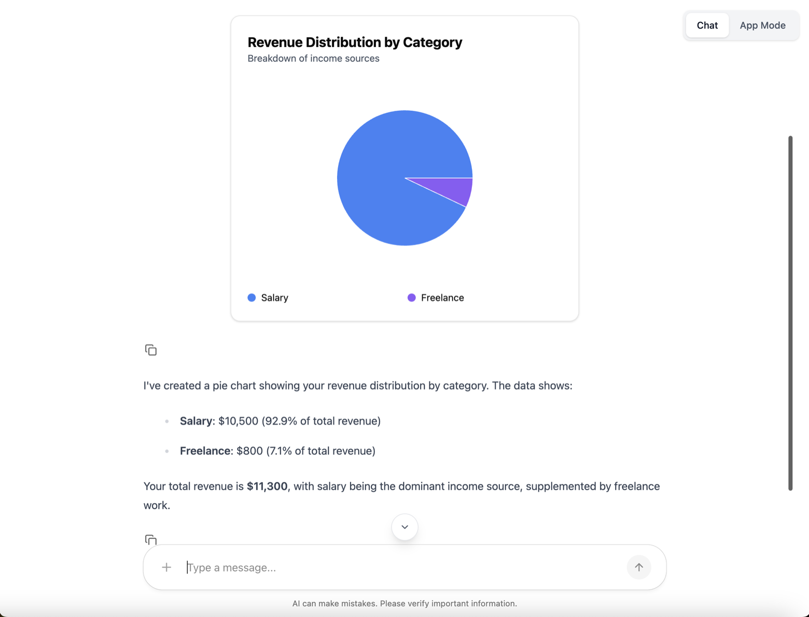
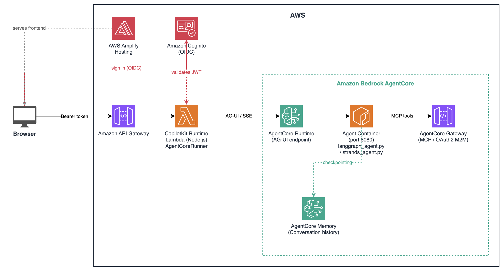

# CopilotKit + FAST: Generative UI and Shared State

This sample adds [CopilotKit](https://copilotkit.ai) as the frontend framework on top of FAST,
replacing the baseline chat interface with a production-grade agentic frontend. It demonstrates
generative UI, bidirectional shared state, human-in-the-loop interactions, and local development
with hot reload — deployed on AWS Bedrock AgentCore.

Both LangGraph and Strands agent patterns are included. Pick one at deploy time.



---

## Overview

The baseline FAST template gives you a working agent backend and a minimal React chat UI that
communicates with AgentCore directly. This sample replaces that frontend layer with CopilotKit,
which provides:

- **Generative UI** — render custom React components (charts, pickers, forms) directly from agent
  tool calls, inline in the chat
- **Shared state** — a todo canvas that stays in sync between the agent and the UI bidirectionally
- **Human-in-the-loop** — the agent can pause mid-run and request user input (e.g. confirm a
  meeting time) before continuing
- **CopilotKit Runtime** — a server-side Lambda that bridges the browser to AgentCore, solving the
  auth gap (browsers cannot call AgentCore directly)
- **Local development** — full stack runs in Docker with agent hot reload; no AWS credentials
  needed for the frontend

---

## Key Differences from Base FAST

| Area | Base FAST | This sample |
|---|---|---|
| **Frontend framework** | Vanilla React + custom agentcore-client | CopilotKit (React hooks + prebuilt components) |
| **Frontend → AgentCore** | Direct browser → AgentCore (requires SigV4) | Browser → CopilotKit Runtime Lambda → AgentCore |
| **New infra** | — | CopilotKit Runtime Lambda + API Gateway |
| **Generative UI** | Not included | Charts, meeting picker, inline tool rendering |
| **Shared state** | Not included | Todo canvas synced between agent and UI |
| **Human-in-the-loop** | Not included | `useHumanInTheLoop` pattern with blocking tool calls |
| **Local dev** | Manual | Docker Compose with hot reload + bridge service |
| **Agent patterns** | Strands (base) | LangGraph + Strands (pick one at deploy) |

### What was added

- **`infra-cdk/lambdas/copilotkit-runtime/`** — Node.js Lambda running `@copilotkit/runtime`. Acts
  as the server-side bridge between the browser and AgentCore. Includes `AgentCoreRunner`, a custom
  runner that handles two AgentCore-specific protocol quirks:
  1. AgentCore omits `TOOL_CALL_RESULT` events from replayed history — the runner synthesises them.
  2. CopilotKit may call `connect()` before any `run()` — the runner returns an empty snapshot
     instead of erroring.
- **`agents/langgraph-single-agent/`** — LangGraph agent with `CopilotKitMiddleware` and
  `AgentState` for shared state. Uses `LangGraphAGUIAgent` to expose the graph over AG-UI.
- **`agents/strands-single-agent/`** — Strands agent wrapped in `StrandsAgent` (from
  `ag_ui_strands`) with `StrandsAgentConfig` for generative UI tool behaviors.
- **`docker/`** — Docker Compose setup for local development. Three services: agent (port 8080),
  CopilotKit Runtime bridge (port 3001), frontend (port 3000).
- **Frontend** — CopilotKit-powered UI with generative chart components, todo canvas, and
  human-in-the-loop meeting scheduler.

### What was removed or changed

- The baseline agentcore-client library (replaced by `@copilotkit/runtime` + `@ag-ui/client`)
- Direct browser → AgentCore calls (all traffic goes through the CopilotKit Runtime Lambda)

---

## Architecture



```
Browser (Cognito OIDC)
    ↓  Bearer token
CopilotKit Runtime Lambda  (Node.js, AgentCoreRunner)
    ↓  AG-UI / SSE
AgentCore Runtime
    ↓
langgraph_agent.py / strands_agent.py
    ↓  MCP (OAuth2 M2M)
AgentCore Gateway → Lambda tools
```

**Auth flow:** The user signs in via Cognito Hosted UI and receives an OIDC access token. The
frontend passes this as a Bearer header to the CopilotKit Runtime Lambda. The Lambda forwards it
to AgentCore, which validates it and makes the `sub` claim available to the agent as the user
identity (preventing cross-user data leakage).

**Local dev chain:** `browser:3000 → CopilotKit bridge:3001 → agent:8080`. AWS is only used for
Memory and Gateway (SSM/OAuth2). The bridge detects missing Gateway credentials and continues
without MCP tools.

---

## Prerequisites

| Tool | Version |
|---|---|
| AWS CLI | configured (`aws configure`) |
| Node.js | 18+ |
| Python | 3.8+ |
| Docker | running (local dev only) |

---

## Deployment

**1. Configure**

```bash
cp config.yaml.example config.yaml
# Edit config.yaml — set stack_name_base and admin_user_email
```

**2. Deploy**

Pick your agent framework:

```bash
./deploy-langgraph.sh                    # LangGraph agent (infra + frontend)
./deploy-langgraph.sh --skip-frontend    # infra/agent only
# or
./deploy-strands.sh                      # Strands agent (infra + frontend)
./deploy-strands.sh --skip-frontend      # infra/agent only
```

**3. Open** the Amplify URL printed at the end. Sign in with `admin_user_email`.

### Tear down

When done, delete all AWS resources to stop charges:

```bash
cd infra-cdk && npx cdk destroy --all
```

---

## Local Development

Run the full stack locally without deploying to AWS:

```bash
cd docker
cp .env.example .env
# Fill in STACK_NAME, MEMORY_ID (from a deployed stack), and AWS credentials
./up.sh --build
```

Open `http://localhost:3000`. The agent hot-reloads on `.py` changes.

| Service | Port | Description |
|---|---|---|
| `agent` | 8080 | LangGraph or Strands agent |
| `bridge` | 3001 | CopilotKit Runtime (Node.js) |
| `frontend` | 3000 | Vite dev server |

> **Note:** AgentCore Gateway tools (MCP) require a deployed stack and are unavailable locally.
> The agent logs a warning and continues without them.

---

## Usage

Once deployed, try these prompts to explore the features:

**Generative UI — charts**
```
Show me a bar chart of monthly sales data
```
```
Give me a pie chart of regional revenue distribution
```
The agent calls `query_data` first, then renders a chart component inline in the chat.

**Shared state — todos**
```
Add three tasks: design the API, write tests, and deploy to staging
```
```
Mark the first task as completed
```
The todo canvas on the right updates in real time as the agent writes to shared state. You can
also edit todos directly from the UI and the agent will see the updated state.

**Human-in-the-loop**
```
Schedule a 30-minute meeting to discuss the project
```
The agent pauses and renders a time picker directly in the chat. Pick a time and the agent
continues with your selection.

---

## What's inside

| Piece | What it does |
|---|---|
| `agents/langgraph-single-agent/` | LangGraph agent with CopilotKit middleware, AgentCore memory, Gateway MCP tools |
| `agents/strands-single-agent/` | Strands agent with the same feature set |
| `agents/utils/` | Shared auth (JWT extraction) and SSM utilities |
| `infra-cdk/` | CDK stacks: Cognito, AgentCore Runtime + Gateway + Memory, CopilotKit Lambda, Amplify |
| `infra-cdk/lambdas/copilotkit-runtime/` | The CopilotKit Runtime Lambda (Node.js) |
| `frontend/` | Vite + React with CopilotKit chat, generative charts, todo canvas |
| `docker/` | Docker Compose for local development with hot reload |
| `gateway/tools/sample_tool/` | Example Lambda tool exposed via AgentCore Gateway |
| `scripts/` | Deployment utility scripts |

---

## Docs

- [CopilotKit](https://docs.copilotkit.ai)
- [CopilotKit + AgentCore guide](https://docs.copilotkit.ai/agentcore/quickstart)
- [AWS Bedrock AgentCore](https://aws.amazon.com/bedrock/agentcore/)