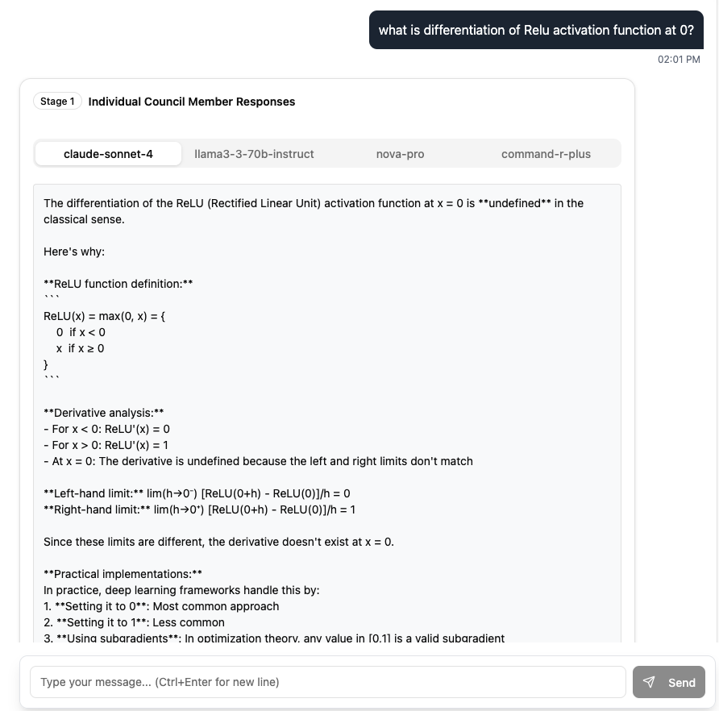
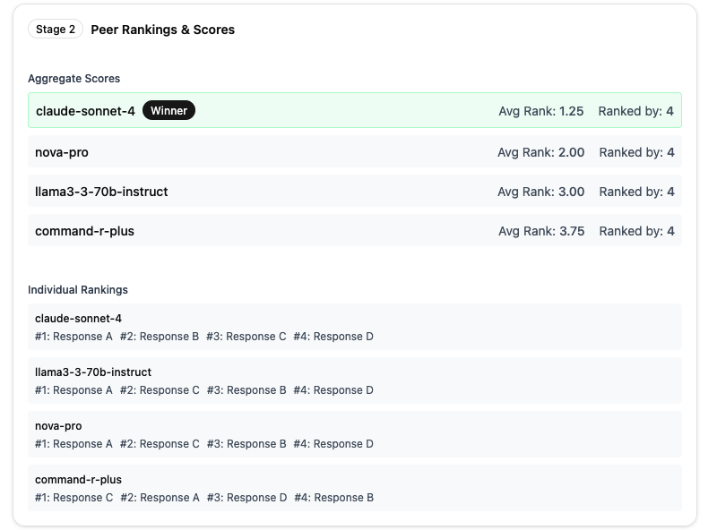
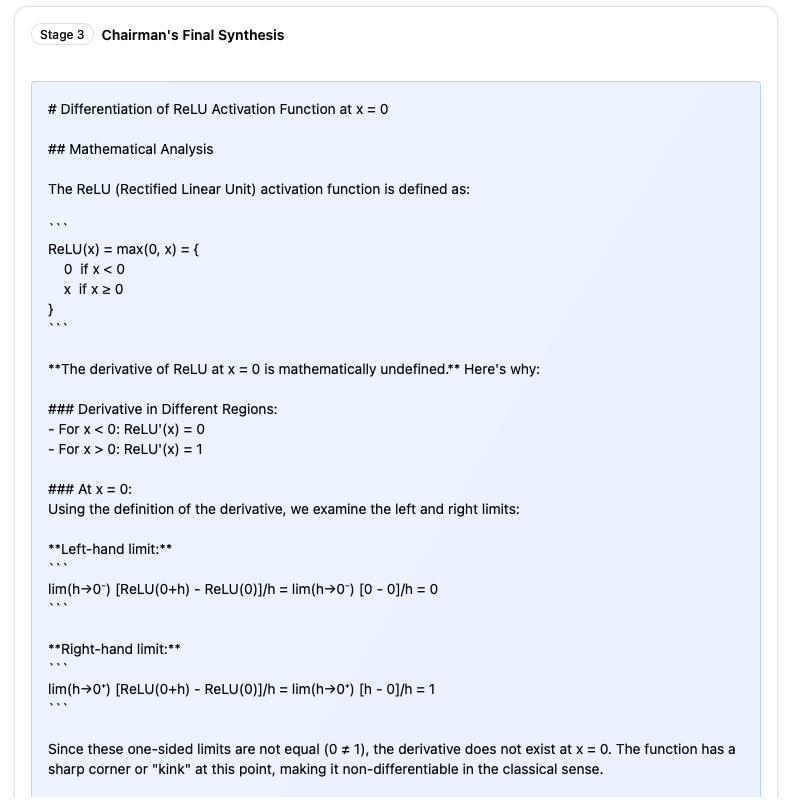
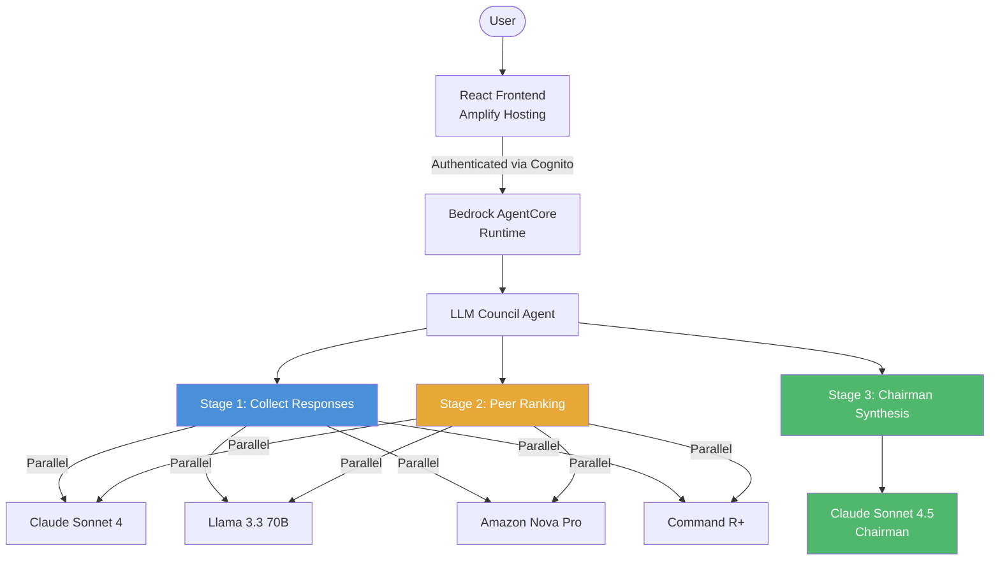
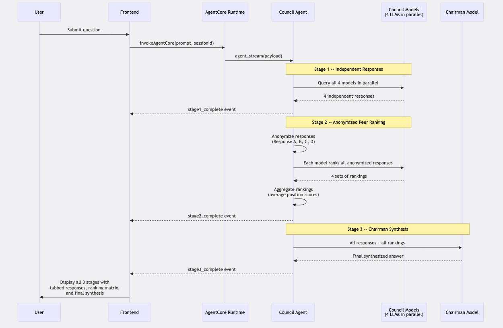
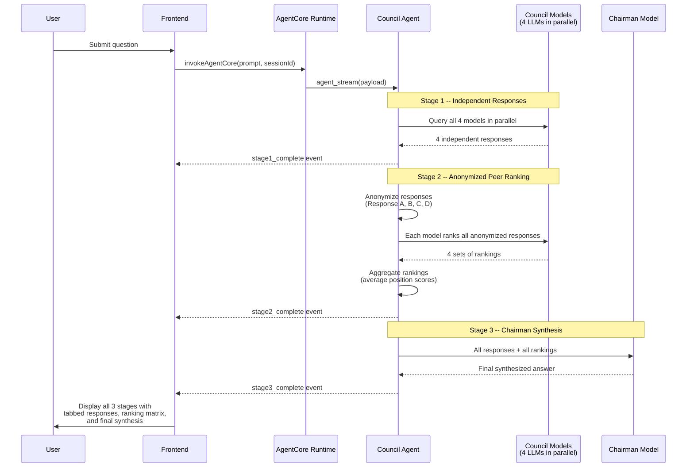
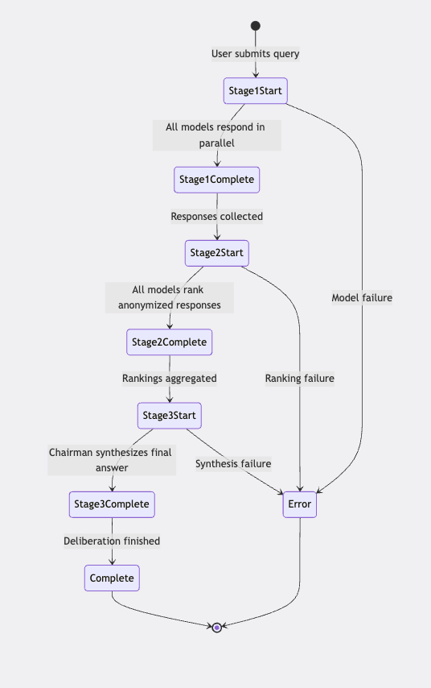
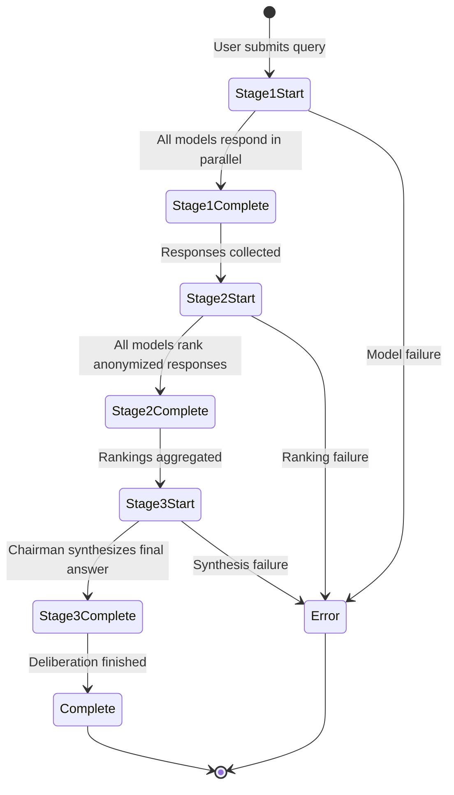
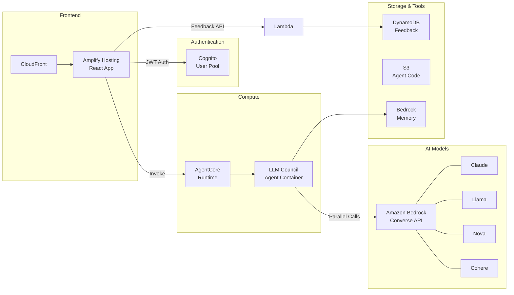

# LLM Council

An implementation of [Andrej Karpathy's Council of LLMs](https://x.com/karpathy/status/1821458514940092673) pattern on AWS, built with Amazon Bedrock AgentCore. Multiple diverse LLMs collaborate through a structured 3-stage deliberation process to produce higher-quality responses than any single model alone.

## How It Works

The LLM Council uses a **3-stage deliberation** process inspired by academic peer review:

1. **Stage 1 -- Independent Response Collection**: All council member models receive the user's question and respond independently, in parallel. No model sees another's answer at this point.

2. **Stage 2 -- Anonymized Peer Ranking**: Each model receives all Stage 1 responses, anonymized as "Response A", "Response B", etc. Each model evaluates and ranks all responses from best to worst. Anonymization prevents brand bias and self-favoritism. Rankings are aggregated into an overall score.

3. **Stage 3 -- Chairman Synthesis**: A designated chairman model receives all individual responses and all peer rankings, then synthesizes a final answer that represents the council's collective wisdom -- combining the strongest elements from each response.

### Default Model Configuration

| Role | Model | Provider |
|------|-------|----------|
| Council Member | `us.anthropic.claude-sonnet-4-20250514-v1:0` | Anthropic |
| Council Member | `us.meta.llama3-3-70b-instruct-v1:0` | Meta |
| Council Member | `us.amazon.nova-pro-v1:0` | Amazon |
| Council Member | `cohere.command-r-plus-v1:0` | Cohere |
| Chairman | `us.anthropic.claude-sonnet-4-5-20250929-v1:0` | Anthropic |

## Screenshots

### Stage 1: Individual Council Member Responses
Each model's independent response is displayed in a tabbed view, allowing side-by-side comparison.



### Stage 2: Peer Rankings & Scores
Aggregate scores show which model performed best across all peer evaluations, along with each model's individual ranking.



### Stage 3: Chairman's Final Synthesis
The chairman model synthesizes the best elements from all responses into a single, comprehensive answer.



## Architecture Diagrams

### High-Level Architecture


<details>
<summary>Mermaid source</summary>


</details>

### 3-Stage Deliberation Flow



<details>
<summary>Mermaid source</summary>


</details>

### Event Streaming Flow



<details>
<summary>Mermaid source</summary>


</details>

### AWS Infrastructure



## Project Structure

```
llm-council/
├── patterns/
│   └── llm-council-agent/        # Core council implementation
│       ├── council_agent.py      # AgentCore entrypoint
│       ├── council.py            # 3-stage orchestration logic
│       ├── bedrock_client.py     # Parallel Bedrock model invocation
│       ├── config.py             # Environment-based configuration
│       ├── prompts.py            # Deliberation prompt templates
│       ├── ranking_parser.py     # Ranking extraction & aggregation
│       ├── requirements.txt      # Python dependencies
│       └── Dockerfile            # Container image definition
├── frontend/                     # React + TypeScript UI
├── infra-cdk/                    # AWS CDK infrastructure
│   └── config.yaml               # Stack & model configuration
├── gateway/                      # AgentCore Gateway (tools)
├── tools/                        # Code interpreter
├── scripts/                      # Deployment utilities
├── tests/                        # Unit & integration tests
├── docs/                         # Additional documentation
└── Makefile                      # Build & lint commands
```

## Setup & Deployment

### Prerequisites

- **Node.js** 20+
- **Python** 3.11+
- **AWS CLI** configured with appropriate credentials
- **AWS CDK CLI** (`npm install -g aws-cdk`)
- **Docker** (or Finch on macOS)
- An AWS account with access to the Bedrock models listed above

### 1. Configure the Stack

Edit `infra-cdk/config.yaml` to customize:

```yaml
stack_name_base: FAST-stack

backend:
  pattern: llm-council-agent
  deployment_type: docker  # or: zip

  llm_council:
    council_models:
      - us.anthropic.claude-sonnet-4-20250514-v1:0
      - us.meta.llama3-3-70b-instruct-v1:0
      - us.amazon.nova-pro-v1:0
      - cohere.command-r-plus-v1:0
    chairman_model: us.anthropic.claude-sonnet-4-5-20250929-v1:0
```

You can swap models for any Bedrock-supported model. Use a mix of providers for diverse perspectives.

### 2. Deploy Infrastructure

```bash
cd infra-cdk
npm install
cdk bootstrap   # Only needed once per account/region
cdk deploy --all
```

This deploys:
- Cognito User Pool for authentication
- AgentCore Runtime with the council agent (Docker or ZIP)
- Bedrock Memory resource
- Feedback API (Lambda + DynamoDB)
- Amplify Hosting for the frontend

### 3. Deploy Frontend

```bash
cd ..
python scripts/deploy-frontend.py
```

### 4. Create a User

Either set `admin_user_email` in `config.yaml` before deploying, or create a user manually via the AWS Cognito Console.

### 5. Access the Application

After deployment, access the application at the Amplify Hosting URL printed in the CDK output. Log in with your Cognito user credentials.

## Configuration Reference

| Environment Variable | Description | Set By |
|---------------------|-------------|--------|
| `COUNCIL_MODELS` | JSON array of Bedrock model IDs for council members | CDK (from config.yaml) |
| `CHAIRMAN_MODEL` | Bedrock model ID for the chairman | CDK (from config.yaml) |
| `MEMORY_ID` | Bedrock Memory resource ID (optional) | CDK |
| `AWS_DEFAULT_REGION` | AWS region (default: `us-east-1`) | CDK |

Internal constants in `config.py`:

| Constant | Default | Description |
|----------|---------|-------------|
| `MODEL_TIMEOUT` | 120s | Timeout per model invocation |
| `MAX_TOKENS` | 4096 | Maximum tokens per model response |
| Minimum council size | 3 | At least 3 models must respond for deliberation to proceed |

## Streaming Event Format

The agent streams Server-Sent Events (SSE) to the frontend as each stage completes:

```
stage1_start     -> "Collecting responses from 4 council members..."
stage1_complete  -> { stage1: [{ model, response }, ...] }
stage2_start     -> "Council members are reviewing and ranking responses..."
stage2_complete  -> { stage2: [{ model, ranking, parsed_ranking }], metadata: { label_to_model, aggregate_rankings } }
stage3_start     -> "Chairman is synthesizing final response..."
stage3_complete  -> { stage3: { model, response } }
complete         -> "Council deliberation complete"
```

## Deployment Options

| Option | Use Case | Pros | Cons |
|--------|----------|------|------|
| **Docker** (default) | Production, complex dependencies | Full control, native libraries supported, ARM64 optimized | Slower build/deploy cycle |
| **ZIP** | Development, fast iteration | Quick deployment, simpler pipeline | Pure Python dependencies only |

Set `deployment_type` in `config.yaml` to switch between them.

## Further Reading

- `docs/DEPLOYMENT.md` -- Detailed deployment guide and troubleshooting
- `docs/AGENT_CONFIGURATION.md` -- Agent patterns and custom agent setup
- `docs/GATEWAY.md` -- AgentCore Gateway and tool integration
- `docs/MEMORY_INTEGRATION.md` -- Short-term and long-term memory configuration
- `docs/STREAMING.md` -- Streaming event handling for all agent types
