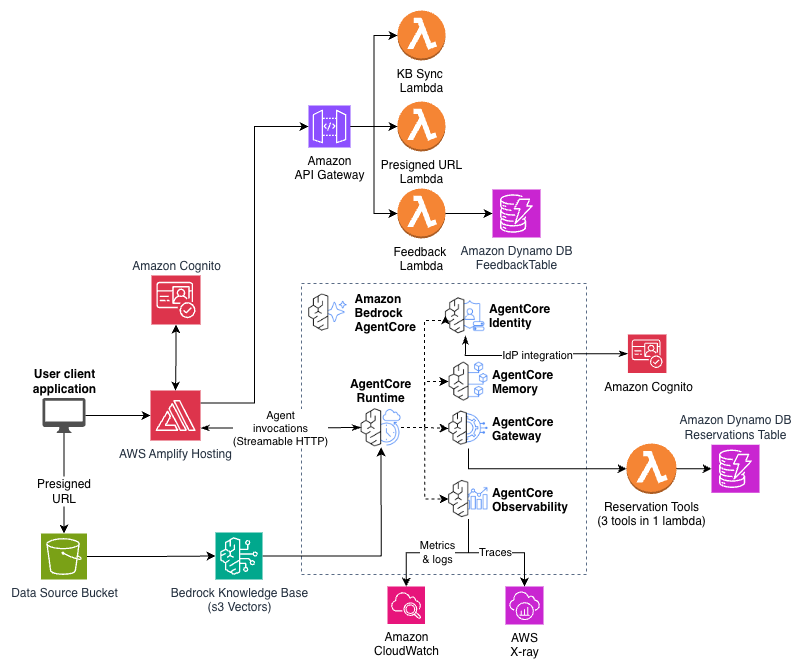

# Restaurant Assistant Sample

Built on the [Fullstack AgentCore Solution Template (FAST)](https://github.com/awslabs/fullstack-solution-template-for-agentcore) v0.4.1.

This sample demonstrates how to transform the FAST baseline chat application into a restaurant assistant with knowledge base integration, reservation management, and a professional customer-facing interface.

**Major Additions to FAST**:
- Separate Knowledge Base stack with S3 Vectors
- DynamoDB reservations table with composite key (booking_id, restaurant_name)
- Custom reservation tools Lambda with tool name routing pattern
- Restaurant-themed landing page with floating chat widget
- File upload with presigned URLs and Knowledge Base sync endpoint
- Restaurant Helper agent persona with Knowledge Base retrieval

**Major Removals from FAST**:
- Sample tool Lambda (replaced with reservation tools)
- Code Interpreter tools (replaced with KB retrieve)
- Default chat-only interface (replaced with landing page + widget)
- Unused agent patterns (langgraph, claude-agent-sdk)
- Terraform infrastructure (CDK only)

## Deployment

```bash
cd infra-cdk
npm install
cdk bootstrap  # once per account/region
cdk deploy fast-restaurant-kb
cdk deploy fast-restaurant
cd ..
python scripts/deploy-frontend.py
```

After deployment, upload the `.docx` files from `sample-data/` via the "Manage Docs" button in the UI, then click "Sync Knowledge Base."

## Application Screenshot


## Architecture



The architecture follows the FAST baseline with these additions:

- **Knowledge Base Stack** (`fast-restaurant-kb`): S3 data bucket, S3 Vector Bucket + Index, Bedrock Knowledge Base with S3 Vectors storage, S3 Data Source
- **Backend additions**: DynamoDB reservations table, reservation tools Lambda behind AgentCore Gateway, presigned URL Lambda, sync KB Lambda, `/upload` and `/sync` API Gateway endpoints
- **Agent**: Strands agent with Restaurant Helper persona, `retrieve` tool for KB queries, gateway MCP tools for reservations
- **Frontend**: Restaurant landing page with hero section, featured restaurants, floating chat widget, and KB document upload panel

## Sample Queries

After uploading the sample data and syncing the Knowledge Base, try these queries in the chat widget:

- "What restaurants are available?"
- "Tell me about the best French restaurant"
- "Make a reservation for 2 at Bistro Parisienne on Friday at 7pm under the name John"
- "Check on the status of my reservation with booking ID booking-abc123 at Bistro Parisienne"
- "Cancel my reservation booking-abc123 at Bistro Parisienne"
- "What's on the menu at Ember?"
- "Which restaurants are good for a large group?"

## Sample Data

The `.docx` files in `sample-data/` contain fictional restaurant descriptions, menus, and locations. The restaurant images on the landing page are AI-generated and do not depict real establishments.

## Security

This asset represents a proof-of-value and is not intended as a production-ready solution. See the [FAST documentation](docs/) for security best practices.

## License

This project is licensed under the Apache-2.0 License.
